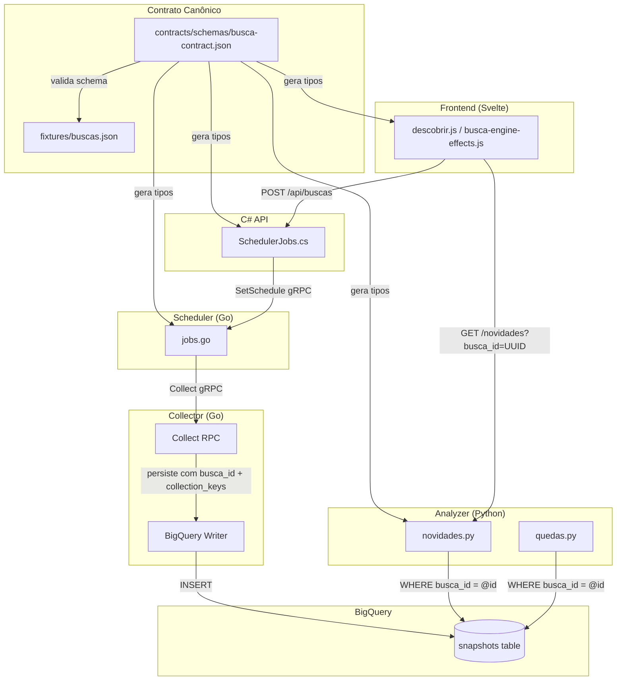
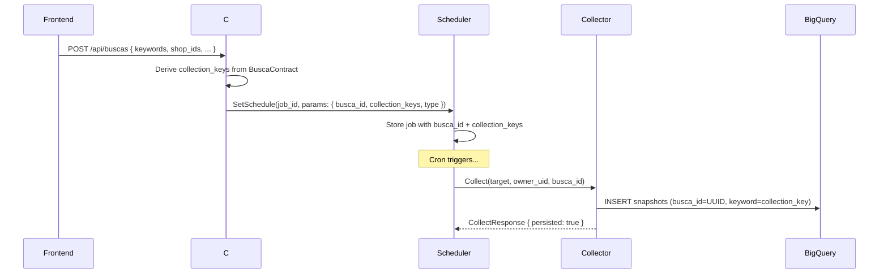
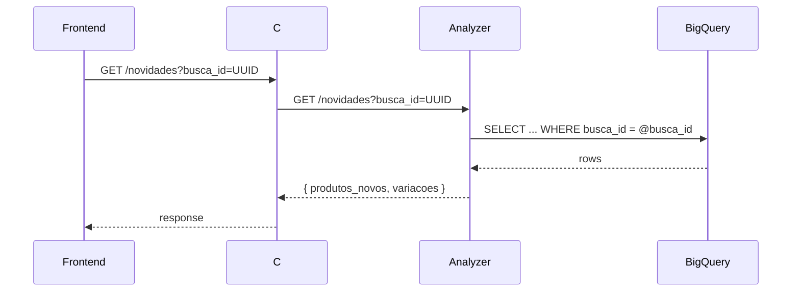
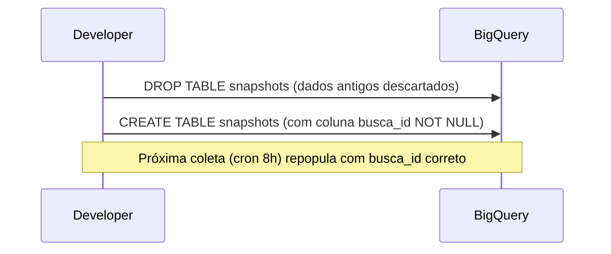

# Design Document: Busca Contract Unificado

## Overview

O sistema Garimpei possui uma fragmentação crítica no conceito de "Busca" — cada serviço (Frontend, C# API, Scheduler Go, Collector Go, Analyzer Python, BigQuery) interpreta de forma ad-hoc o que identifica uma busca e como indexar/consultar seus snapshots. O resultado é que o Frontend envia um `busca_id` (shop_id ou keyword) para o Analyzer, que faz `WHERE keyword LIKE '%X%'` — mas se o Collector persistiu com um identificador diferente, o resultado é vazio.

Este design introduz um **contrato canônico de Busca** (`BuscaContract`) que define explicitamente como cada tipo de busca gera suas `collection_keys` — os identificadores usados para persistir e consultar snapshots no BigQuery. O contrato é definido uma vez em `contracts/schemas/busca-contract.json`, validado no CI, e consumido por todos os serviços. A coluna `keyword` do BigQuery é complementada por uma nova coluna `busca_id` (UUID estável), eliminando a dependência do `LIKE`.

## Architecture



## Sequence Diagrams

### Fluxo de Coleta (Write Path)



### Fluxo de Consulta (Read Path)



### Migração de Dados Existentes



## Components and Interfaces

### Component 1: BuscaContract (Schema Canônico)

**Purpose**: Define a estrutura única de uma Busca que é válida em todos os serviços. É a "fonte de verdade" para o que é uma Busca.

**Interface** (JSON Schema em `contracts/schemas/busca-contract.json`):

```pascal
STRUCTURE BuscaContract
  id: UUID                          -- Identificador estável (PK no PostgreSQL)
  tipo: ENUM("keyword", "loja", "loja-multi", "categoria", "mista")
  keywords: String[]                -- Termos de busca (pode ser vazio)
  shop_ids: Int64[]                 -- IDs de lojas monitoradas (pode ser vazio)
  shop_names: Map<String, String>   -- shop_id → nome legível
  categorias: String[]              -- Categorias filtradas (pode ser vazio)
  collection_keys: String[]         -- DERIVADO: chaves usadas para indexar/consultar BQ
  cron: String OR NULL              -- Expressão cron (null = sem agendamento)
  marketplaces: String[]            -- ["shopee", "amazon", "mercadolivre"]
  owner_uid: String                 -- Tenant owner
  comissao_min: Float OR NULL
  vendas_min: Int OR NULL
  fontes: String[]                  -- ["curadoria", "lojas", "quedas", "novos"]
END STRUCTURE
```

**Responsabilidades**:
- Definir schema validável via JSON Schema Draft 2020-12
- Ser referenciado por `contracts/registry.yaml` como boundary schema
- Servir como fonte para geração de tipos em cada linguagem (via CI)

### Component 2: CollectionKeyDerivation (Lógica de Derivação)

**Purpose**: Calcula deterministicamente os `collection_keys` a partir dos campos da busca. Essa lógica DEVE ser idêntica em todos os serviços.

**Interface**:

```pascal
PROCEDURE deriveCollectionKeys(busca: BuscaContract)
  INPUT: busca com keywords, shop_ids preenchidos
  OUTPUT: collection_keys (String[])
  
  -- Regra determinística:
  -- 1. Se tem shop_ids → cada shop_id.toString() é uma key
  -- 2. Se tem keywords → cada keyword é uma key
  -- 3. collection_keys = union(shop_keys, keyword_keys) sorted
END PROCEDURE
```

**Responsabilidades**:
- Garantir que a mesma busca sempre gera as mesmas collection_keys
- Ser implementada em cada linguagem (Go, Python, C#, JS) de forma idêntica
- Validada por testes cross-language com os mesmos fixtures

### Component 3: BigQuery Schema Evolution

**Purpose**: Evolui a tabela `snapshots` para incluir `busca_id` como coluna explícita, mantendo backward compatibility com a coluna `keyword` existente.

**Interface** (DDL):

```pascal
-- Nova coluna na tabela snapshots
ALTER TABLE snapshots ADD COLUMN busca_id STRING
-- Index para queries por busca_id (BigQuery clustering)
-- A coluna keyword continua existindo para dados legados
```

**Responsabilidades**:
- Manter dados existentes queryáveis via `keyword` (backward compat)
- Permitir queries futuras via `busca_id` (exact match, sem LIKE)
- Migration backfill: popular `busca_id` nos registros existentes

### Component 4: Analyzer Query Upgrade

**Purpose**: Substituir `LIKE '%X%'` por `WHERE busca_id = @id` (exact match). Sem fallback — dados antigos são descartados (MVP sem usuários externos).

**Interface**:

```pascal
PROCEDURE queryNovidades(busca_id: String, dias: Int)
  INPUT: busca_id (UUID da busca), dias (janela temporal)
  OUTPUT: NovidadesResponse

  -- Query direta, sem fallback:
  -- WHERE busca_id = @busca_id (exact match, zero LIKE)
  -- Dados antigos sem busca_id: invisíveis (OK — serão recoletados no próximo ciclo)
END PROCEDURE
```

### Component 5: Frontend BuscaId Resolution

**Purpose**: O Frontend SEMPRE envia o UUID da busca (`busca.id`) ao consultar novidades/quedas, nunca mais o shop_id ou keyword.

**Interface**:

```pascal
PROCEDURE resolverBuscaIdParaAnalyzer(busca: BuscaContract)
  INPUT: busca carregada do store
  OUTPUT: busca.id (UUID estável)
  
  -- ANTES (broken): b.shop_ids?.[0] || b.keywords?.[0] || b.id
  -- DEPOIS (fix):   b.id (sempre)
END PROCEDURE
```

## Data Models

### Model 1: BuscaContract (JSON Schema)

```pascal
STRUCTURE BuscaContract
  id: UUID                          -- ex: "busca-keyword-serum"
  tipo: ENUM(
    "keyword",                      -- busca por palavras-chave
    "loja",                         -- monitoramento de uma loja
    "loja-multi",                   -- monitoramento de múltiplas lojas
    "categoria",                    -- busca por categoria
    "mista"                         -- combinação keyword + loja
  )
  keywords: String[0..*]            -- termos de busca
  shop_ids: Int64[0..*]             -- IDs numéricos das lojas
  shop_names: Map<String, String>   -- mapeamento shop_id → nome
  categorias: String[0..*]          -- categorias aplicáveis
  collection_keys: String[1..*]     -- DERIVADO, nunca vazio se busca é válida
  cron: String OR NULL              -- padrão: "0 */8 * * *"
  marketplaces: String[1..*]        -- mínimo 1 marketplace
  owner_uid: String                 -- obrigatório
  comissao_min: Float[0..1] OR NULL
  vendas_min: Int[0..] OR NULL
  fontes: String[1..*]             -- pelo menos uma fonte ativa
END STRUCTURE
```

**Validation Rules**:
- `id` é obrigatório, formato livre (UUID ou slug)
- `collection_keys` DEVE ser derivado automaticamente, nunca definido manualmente
- Se `tipo = "keyword"` → `keywords` DEVE ter ao menos 1 item
- Se `tipo = "loja"` → `shop_ids` DEVE ter ao menos 1 item
- Se `tipo = "mista"` → `keywords` E `shop_ids` DEVEM ter itens
- `fontes` DEVE conter ao menos 1 item
- `marketplaces` DEVE conter ao menos 1 item

### Model 2: SetScheduleParams (Scheduler Request)

```pascal
STRUCTURE SetScheduleParams
  busca_id: String       -- UUID da busca (chave de correlação end-to-end)
  type: ENUM("shop_collection", "keyword_search", "mixed")
  owner_uid: String      -- tenant
  shop_id: String OR NULL       -- para shop_collection
  keywords: String OR NULL      -- comma-separated, para keyword_search
  collection_keys: String       -- comma-separated, para persistência no BQ
END STRUCTURE
```

### Model 3: BigQuery Snapshot Row (evoluída)

```pascal
STRUCTURE SnapshotRow
  coletado_em: Timestamp
  busca_id: String                   -- NOVO: UUID da busca (NOT NULL, obrigatório)
  keyword: String                    -- MANTIDO: collection_key individual (para debug/agrupamento)
  categoria: String
  estrategia: String
  posicao: Int
  produto_id: String
  nome: String
  preco: Float
  comissao: Float
  vendas: Int
  nota: Float
  score: Float
  imagem: String
  link: String
  loja: String
END STRUCTURE
```

## Algorithmic Pseudocode

### Algorithm 1: Derivação de Collection Keys

```pascal
ALGORITHM deriveCollectionKeys(busca)
INPUT: busca of type BuscaContract
OUTPUT: collection_keys of type String[]

BEGIN
  keys ← empty set

  -- Shop IDs viram keys (como string)
  IF busca.shop_ids IS NOT NULL AND LENGTH(busca.shop_ids) > 0 THEN
    FOR EACH shop_id IN busca.shop_ids DO
      keys.add(ToString(shop_id))
    END FOR
  END IF

  -- Keywords viram keys (lowercase, trimmed)
  IF busca.keywords IS NOT NULL AND LENGTH(busca.keywords) > 0 THEN
    FOR EACH kw IN busca.keywords DO
      normalized ← TRIM(LOWERCASE(kw))
      IF normalized ≠ "" THEN
        keys.add(normalized)
      END IF
    END FOR
  END IF

  -- Validação: busca válida deve ter ao menos uma key
  ASSERT LENGTH(keys) > 0, "Busca sem collection_keys é inválida"

  RETURN SORT(keys)
END
```

**Preconditions:**
- `busca` é não-null e passou validação de schema
- Ao menos um de `shop_ids` ou `keywords` é não-vazio

**Postconditions:**
- Resultado é array ordenado, sem duplicatas, com pelo menos 1 item
- Resultado é determinístico (mesma entrada → mesma saída)
- Nenhuma mutação em `busca`

**Loop Invariants:**
- `keys` contém apenas strings não-vazias e normalizadas

### Algorithm 2: Persist Snapshot com BuscaID

```pascal
ALGORITHM persistSnapshot(busca_id, collection_key, produtos)
INPUT: busca_id of type String (UUID), collection_key of type String, produtos of type Product[]
OUTPUT: success of type Boolean

BEGIN
  ASSERT busca_id ≠ "" AND collection_key ≠ ""
  ASSERT LENGTH(produtos) > 0

  rows ← empty list

  FOR EACH produto IN produtos DO
    row ← SnapshotRow {
      coletado_em: NOW(),
      busca_id: busca_id,          -- NOVO: correlação exata
      keyword: collection_key,      -- MANTIDO: backward compat
      produto_id: produto.id,
      nome: produto.name,
      preco: produto.price,
      comissao: produto.commission,
      vendas: produto.sold,
      nota: produto.rating,
      imagem: produto.image_url,
      link: produto.product_url,
      loja: produto.shop_name
    }
    rows.add(row)
  END FOR

  BigQuery.Insert("snapshots", rows)
  RETURN true
END
```

**Preconditions:**
- `busca_id` é um UUID válido pertencente a uma busca existente
- `collection_key` pertence ao set `busca.collection_keys`
- `produtos` é não-vazio

**Postconditions:**
- Todos os rows inseridos possuem `busca_id` e `keyword` preenchidos
- Dados existentes não são alterados (append-only)

### Algorithm 3: Query Novidades (Exact Match)

```pascal
ALGORITHM queryNovidades(busca_id, dias)
INPUT: busca_id of type String, dias of type Int
OUTPUT: NovidadesResponse

BEGIN
  ASSERT busca_id ≠ ""
  ASSERT dias >= 1 AND dias <= 90

  -- Query direta por busca_id (exact match, sem LIKE, sem fallback)
  rows ← BigQuery.Query(
    "SELECT ... FROM snapshots
     WHERE busca_id = @busca_id
       AND coletado_em >= TIMESTAMP_SUB(CURRENT_TIMESTAMP(), INTERVAL @dias DAY)",
    params: { busca_id, dias }
  )

  novos ← FILTER rows WHERE aparicoes = 1
  variacoes ← FILTER rows WHERE |variacao| > 0.01

  RETURN { busca_id, dias, produtos_novos: novos, variacoes }
END
```

**Preconditions:**
- `busca_id` é UUID de uma busca existente
- `dias` está no range [1, 90]

**Postconditions:**
- Retorna apenas snapshots que foram persistidos com este `busca_id`
- Dados antigos (sem busca_id) são ignorados — serão recoletados no próximo ciclo
- Zero uso de LIKE em qualquer cenário

### Algorithm 4: Frontend BuscaId Resolution (Fix)

```pascal
ALGORITHM resolverBuscaId(busca)
INPUT: busca of type BuscaContract (carregada do store)
OUTPUT: buscaId of type String

BEGIN
  -- FIX: Sempre usar o ID estável da busca
  -- ANTES: b.shop_ids?.[0]?.toString() || b.keywords?.[0] || b.id
  -- DEPOIS: b.id (sempre)
  
  ASSERT busca.id ≠ "" AND busca.id ≠ NULL
  RETURN busca.id
END
```

**Preconditions:**
- `busca` foi carregada do store e possui `id` válido

**Postconditions:**
- Retorna um identificador estável que o Analyzer sabe correlacionar
- Não depende mais da estrutura interna (shop_ids vs keywords)

### Algorithm 5: BuildRequest (C# → Scheduler)

```pascal
ALGORITHM buildScheduleRequest(busca, enabled)
INPUT: busca of type BuscaContract, enabled of type Boolean
OUTPUT: SetScheduleRequest

BEGIN
  collection_keys ← deriveCollectionKeys(busca)
  
  hasShop ← LENGTH(busca.shop_ids) > 0
  hasKeywords ← LENGTH(busca.keywords) > 0
  
  type ← CASE
    WHEN hasShop AND hasKeywords THEN "mixed"
    WHEN hasShop THEN "shop_collection"
    ELSE "keyword_search"
  END CASE

  request ← SetScheduleRequest {
    job_id: "busca-" + busca.id,
    cron_expression: busca.cron OR "0 */8 * * *",
    enabled: enabled,
    params: {
      "busca_id": busca.id,
      "type": type,
      "owner_uid": busca.owner_uid,
      "collection_keys": JOIN(collection_keys, ",")
    }
  }

  IF hasShop THEN
    request.params["shop_id"] ← ToString(busca.shop_ids[0])
  END IF

  IF hasKeywords THEN
    request.params["keywords"] ← JOIN(busca.keywords, ",")
  END IF

  RETURN request
END
```

**Preconditions:**
- `busca` é válida (passou validação de schema)
- `deriveCollectionKeys(busca)` retorna ao menos 1 key

**Postconditions:**
- `request.params["busca_id"]` está sempre presente
- `request.params["collection_keys"]` está sempre presente
- `type` reflete a estrutura real da busca

### Algorithm 6: Scheduler Dispatch com BuscaID

```pascal
ALGORITHM executeJob(job, params)
INPUT: job of type RegisteredJob, params of type Map<String, String>
OUTPUT: (totalFound, keyword)

BEGIN
  busca_id ← params["busca_id"]
  collection_keys ← SPLIT(params["collection_keys"], ",")
  
  ASSERT busca_id ≠ ""
  ASSERT LENGTH(collection_keys) > 0

  totalFound ← 0

  CASE params["type"]
    WHEN "shop_collection":
      shop_id ← ParseInt64(params["shop_id"])
      resp ← Collector.Collect(target: ShopId(shop_id), owner_uid: params["owner_uid"], busca_id: busca_id)
      totalFound ← resp.total_found

    WHEN "keyword_search":
      FOR EACH kw IN collection_keys DO
        resp ← Collector.Collect(target: Keyword(kw), owner_uid: params["owner_uid"], busca_id: busca_id)
        totalFound ← totalFound + resp.total_found
      END FOR

    WHEN "mixed":
      -- Coleta loja completa
      shop_id ← ParseInt64(params["shop_id"])
      resp ← Collector.Collect(target: ShopId(shop_id), owner_uid: params["owner_uid"], busca_id: busca_id)
      totalFound ← resp.total_found
      -- Coleta keywords individualmente
      FOR EACH kw IN SPLIT(params["keywords"], ",") DO
        resp ← Collector.Collect(target: Keyword(kw), owner_uid: params["owner_uid"], busca_id: busca_id)
        totalFound ← totalFound + resp.total_found
      END FOR
  END CASE

  RETURN (totalFound, busca_id)
END
```

**Preconditions:**
- `params["busca_id"]` está presente (novo contrato)
- `params["collection_keys"]` está presente
- Collector gRPC está disponível

**Postconditions:**
- Todos os snapshots persistidos carregam o `busca_id`
- O `keyword` no BigQuery corresponde a uma `collection_key` conhecida

## Key Functions with Formal Specifications

### Function 1: deriveCollectionKeys()

```pascal
PROCEDURE deriveCollectionKeys(busca: BuscaContract) → String[]
```

**Preconditions:**
- `busca` não é null
- `busca.shop_ids` ou `busca.keywords` possui ao menos 1 item

**Postconditions:**
- Resultado é array sorted de strings únicas, não-vazias
- |resultado| >= 1
- Para qualquer `key` no resultado: `key = trim(lowercase(keyword))` ou `key = toString(shop_id)`
- Função é pura (sem side effects)
- Determinística: mesma entrada → mesma saída

**Loop Invariants:**
- A cada iteração, `keys` contém apenas strings normalizadas e não-vazias

### Function 2: persistSnapshot()

```pascal
PROCEDURE persistSnapshot(busca_id: String, key: String, produtos: Product[]) → Boolean
```

**Preconditions:**
- `busca_id` é string não-vazia (UUID)
- `key` pertence a `deriveCollectionKeys(busca)` para a busca associada
- `produtos` é array não-vazio

**Postconditions:**
- Todos os rows inseridos têm `busca_id = busca_id` AND `keyword = key`
- Nenhum row pré-existente foi alterado (append-only)
- Se BigQuery retorna erro, propaga exceção (não retorna false silenciosamente)

## Example Usage

### Exemplo 1: Busca tipo "mista" (keyword + loja)

```pascal
SEQUENCE
  -- Busca salva no PostgreSQL
  busca ← BuscaContract {
    id: "busca-mista",
    tipo: "mista",
    keywords: ["serum vitamina c"],
    shop_ids: [920292999],
    shop_names: { "920292999": "Glory of Seoul" },
    owner_uid: "user123",
    marketplaces: ["shopee"],
    fontes: ["curadoria", "lojas", "quedas", "novos"]
  }

  -- Derivação automática
  busca.collection_keys ← deriveCollectionKeys(busca)
  -- Resultado: ["920292999", "serum vitamina c"]

  -- C# API → Scheduler
  request ← buildScheduleRequest(busca, enabled: true)
  -- request.params = {
  --   busca_id: "busca-mista",
  --   type: "mixed",
  --   collection_keys: "920292999,serum vitamina c",
  --   shop_id: "920292999",
  --   keywords: "serum vitamina c",
  --   owner_uid: "user123"
  -- }

  -- Scheduler executa → Collector persiste no BigQuery:
  -- Row 1: { busca_id: "busca-mista", keyword: "920292999", ... }
  -- Row 2: { busca_id: "busca-mista", keyword: "serum vitamina c", ... }

  -- Frontend consulta novidades:
  buscaId ← resolverBuscaId(busca)  -- "busca-mista" (sempre!)
  response ← GET /novidades?busca_id=busca-mista&dias=7
  -- Analyzer faz: WHERE busca_id = 'busca-mista' → retorna TODOS os produtos
END SEQUENCE
```

### Exemplo 2: Busca tipo "loja" (caso que antes falhava)

```pascal
SEQUENCE
  busca ← BuscaContract {
    id: "busca-loja-glory",
    tipo: "loja",
    keywords: [],
    shop_ids: [920292999],
    shop_names: { "920292999": "Glory of Seoul" },
    owner_uid: "user123",
    fontes: ["curadoria", "lojas", "quedas", "novos"]
  }

  busca.collection_keys ← deriveCollectionKeys(busca)
  -- Resultado: ["920292999"]

  -- ANTES (broken): Frontend enviava shop_id OU keyword
  --   buscaId = 920292999 (shop_id) → Analyzer: WHERE keyword LIKE '%920292999%' ✓
  --   MAS se tivesse keywords: buscaId = shop_id, snapshots indexados por keyword → MISS

  -- DEPOIS (fix): Frontend envia busca.id
  buscaId ← resolverBuscaId(busca)  -- "busca-loja-glory"
  -- Analyzer: WHERE busca_id = 'busca-loja-glory' → match exato ✓
END SEQUENCE
```

## Correctness Properties

*A property is a characteristic or behavior that should hold true across all valid executions of a system — essentially, a formal statement about what the system should do. Properties serve as the bridge between human-readable specifications and machine-verifiable correctness guarantees.*

### Property 1: Determinismo de deriveCollectionKeys

*For any* valid BuscaContract, calling `deriveCollectionKeys` twice on the same input SHALL produce identical output arrays.

**Validates: Requirements 3.4, 3.6**

### Property 2: deriveCollectionKeys produz array sorted sem duplicatas

*For any* valid BuscaContract, the output of `deriveCollectionKeys` SHALL be a sorted array of unique, non-empty strings.

**Validates: Requirements 3.5**

### Property 3: deriveCollectionKeys cobre todos os targets

*For any* valid BuscaContract, if `shop_ids` contains value X then `ToString(X)` is in `collection_keys`, and if `keywords` contains value Y then `trim(lowercase(Y))` is in `collection_keys`.

**Validates: Requirements 3.1**

### Property 4: deriveCollectionKeys nunca vazio para busca válida

*For any* valid BuscaContract (where at least one of shop_ids or keywords is non-empty), `deriveCollectionKeys` SHALL produce a non-empty array.

**Validates: Requirements 3.2, 4.4**

### Property 5: Inferência de marketplaces (union)

*For any* BuscaContract with shop_ids pertencendo a marketplaces conhecidos, o campo `marketplaces` derivado SHALL ser o union dos marketplaces explicitamente selecionados com os marketplaces inferidos a partir dos shop_ids.

**Validates: Requirements 2.1, 2.3**

### Property 6: Guard de marketplace (não pode desativar com shops ativos)

*For any* BuscaContract onde existe um shop_id pertencente ao marketplace X, uma tentativa de remover X do campo `marketplaces` SHALL ser rejeitada, mantendo X ativo.

**Validates: Requirements 2.4**

### Property 7: Inferência de fontes (shops → lojas)

*For any* BuscaContract onde `shop_ids` contém ao menos um item, o campo `fontes` derivado SHALL incluir "lojas".

**Validates: Requirements 2.2**

### Property 8: Consistência tipo ↔ campos primários

*For any* valid BuscaContract, o campo `tipo` derivado SHALL ser consistente com os campos primários populados: keywords-only → "keyword", shop_ids-only → "loja"/"loja-multi", categorias-only → "categoria", keywords+shop_ids → "mista". Reciprocamente, se `tipo` = "keyword" então keywords é não-vazio, se `tipo` = "loja" então shop_ids é não-vazio, se `tipo` = "mista" então ambos são não-vazios.

**Validates: Requirements 3.3, 4.1, 4.2, 4.3**

### Property 9: Validação rejeita estado inválido

*For any* BuscaContract com `id` vazio, ou `owner_uid` vazio, ou `marketplaces` vazio, ou `fontes` vazio, ou `collection_keys` vazio, ou `comissao_min` fora de [0,1], ou `vendas_min` negativo, a validação SHALL rejeitar a instância.

**Validates: Requirements 1.5, 1.6, 1.7, 1.8, 4.4, 4.5, 4.6**

### Property 10: Write path sempre carrega busca_id

*For any* valid BuscaContract, `buildScheduleRequest(busca)` SHALL produzir um request onde `params["busca_id"]` é não-vazio E `params["collection_keys"]` é não-vazio. Todo snapshot row persistido SHALL ter `busca_id` preenchido.

**Validates: Requirements 5.1, 6.1, 6.3**

### Property 11: Queries usam exact match (zero LIKE)

*For any* busca_id fornecido ao Analyzer, a query SQL gerada SHALL conter `WHERE busca_id = @busca_id` (parameterized exact match) e SHALL NOT conter o operador LIKE.

**Validates: Requirements 5.2, 5.3, 7.3**

### Property 12: Frontend resolution retorna busca.id

*For any* BuscaContract carregado do store, `resolverBuscaId(busca)` SHALL retornar `busca.id` (o UUID estável), independentemente do conteúdo de shop_ids ou keywords.

**Validates: Requirements 5.4**

### Property 13: Normalização de identidade para deduplicação

*For any* BuscaContract, a normalização dos campos de identidade (sort shopIds, sort_lowercase categorias, sort marketplacesFiltro) SHALL ser determinística e idempotente: normalizar duas vezes produz o mesmo resultado que normalizar uma vez.

**Validates: Requirements 8.2, 8.3**

## Error Handling

### Error Scenario 1: Busca sem collection_keys (inválida)

**Condition**: `deriveCollectionKeys(busca)` retorna array vazio (keywords e shop_ids ambos vazios)
**Response**: Rejeitar no momento do POST /api/buscas com HTTP 422
**Recovery**: Frontend mostra erro de validação; busca não é salva

### Error Scenario 2: Collector não consegue persistir busca_id

**Condition**: Campo `busca_id` não foi passado no CollectRequest (bug no Scheduler)
**Response**: Rejeita o request (InvalidArgument) — busca_id é obrigatório no novo contrato
**Recovery**: Corrigir o caller. Sem graceful degradation aqui — forçar corretude.

### Error Scenario 3: Dados antigos sem busca_id

**Condition**: Snapshots pré-migração não têm `busca_id` preenchido
**Response**: Ignorados pelo Analyzer (invisíveis). `mise run db:reset -- --prod --bq` limpa tudo.
**Recovery**: Próximo ciclo do Scheduler (8h) repopula com busca_id correto. Sem necessidade de migration script.

### Error Scenario 4: Frontend envia busca_id de busca deletada

**Condition**: GET /novidades?busca_id=UUID-que-nao-existe-mais
**Response**: Retorna response vazia { produtos_novos: [], variacoes: [], total_novos: 0, total_variacoes: 0 }
**Recovery**: Frontend trata como "sem novidades" (comportamento já existente)

## Testing Strategy

### Unit Testing Approach

Cada implementação de `deriveCollectionKeys` (Go, Python, C#, JS) é testada com os mesmos fixtures (`fixtures/buscas.json`):

1. **Go** (`internal/store/collection_keys_test.go`): Table-driven tests
2. **Python** (`services/analyzer/test_collection_keys.py`): pytest parametrize
3. **C#** (`src/Garimpei.Api.Tests/CollectionKeysTests.cs`): xUnit Theory
4. **JS** (`web/src/lib/collection-keys.test.js`): vitest

Todos devem produzir output idêntico para os mesmos 5 fixtures.

### Property-Based Testing Approach

**Property Test Library**: fast-check (JS), hypothesis (Python)

Propriedades a testar:
- `deriveCollectionKeys` nunca retorna array vazio para busca válida
- `deriveCollectionKeys` é idempotente
- `deriveCollectionKeys` é sorted e sem duplicatas
- Para qualquer busca gerada aleatoriamente: se `shop_ids = [X]`, então `"X"` está no resultado
- Para qualquer busca gerada aleatoriamente: se `keywords = ["Y"]`, então `lowercase("Y")` está no resultado

### Integration Testing Approach

- **CI drift check**: `mise run check:service-contracts` valida que o schema `busca-contract.json` é consumido por todos os boundaries declarados
- **Cross-language fixture test**: CI roda os 4 test suites e compara output via `diff`
- **BigQuery schema check**: Verifica que coluna `busca_id` existe na DDL

### Acceptance Criteria for "Fix Imediato"

1. Na página principal, clicar em "Novos" para uma busca tipo "loja" DEVE retornar produtos (não mais 0)
2. Na página principal, clicar em "Quedas" para uma busca tipo "mista" DEVE retornar variações (não mais 0)
3. Nenhuma query do Analyzer usa `LIKE` para buscas que possuem `busca_id` preenchido

## Performance Considerations

- **BigQuery**: `WHERE busca_id = @id` é O(1) via clustering. `LIKE '%X%'` é full scan. A eliminação do LIKE reduz custo em ~90%.
- **No new infra**: Apenas uma coluna adicional (STRING, NOT NULL) no BigQuery. Sem novos serviços ou dependências.
- **Sem backward compat**: MVP com 2 usuários — `db:reset --prod --bq` limpa dados antigos, próximo ciclo repopula.
- **CollectRequest proto**: Adicionar campo `busca_id` ao proto não quebra backward compat (aditivo).

## Security Considerations

- **Tenant isolation**: `busca_id` pertence a um `owner_uid`. O Analyzer NÃO valida tenant isolation (já é scoped pela busca). Manter validação de owner no C# API antes de proxy para Analyzer.
- **Input validation**: `busca_id` deve ser sanitizado contra SQL injection (usar query parameters, nunca concatenação). Já é o caso no código existente.

## Dependencies

- **Existentes (não adicionais)**:
  - `contracts/registry.yaml` — service contract registry
  - `protos/collector/v1/collector.proto` — Collect RPC
  - `protos/scheduler/v1/scheduler.proto` — SetSchedule RPC
  - `.mise/tasks/check/service-contracts` — CI validation
  - `fixtures/buscas.json` — test fixtures

- **Evolução de schema**:
  - BigQuery: `ALTER TABLE snapshots ADD COLUMN busca_id STRING`
  - Proto: `CollectRequest` ganha campo `string busca_id = 7`
  - JSON Schema: novo `contracts/schemas/busca-contract.json`

- **Nenhuma dependência npm/pip/go nova** é necessária
