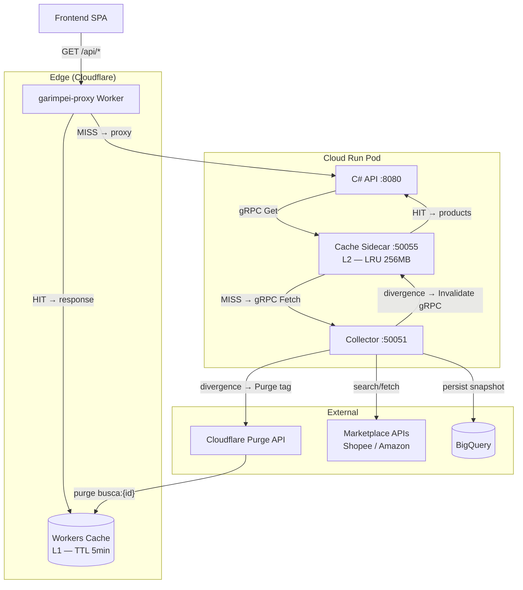
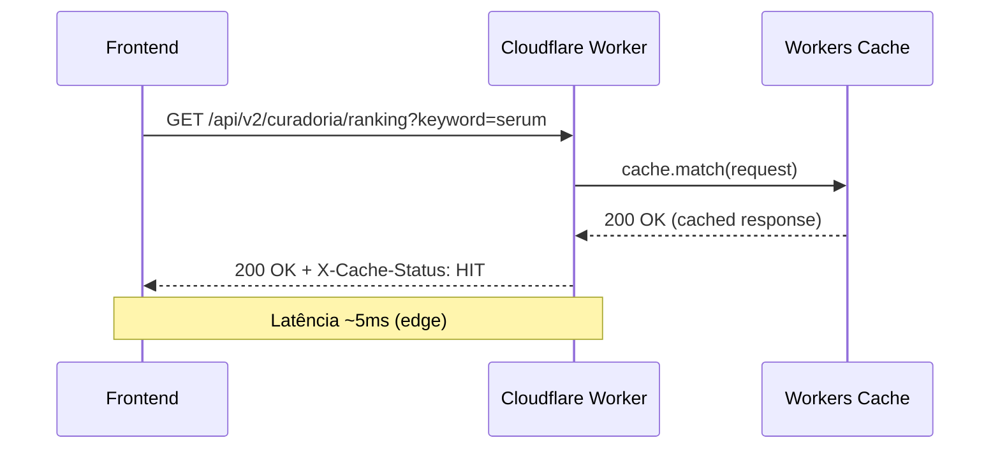
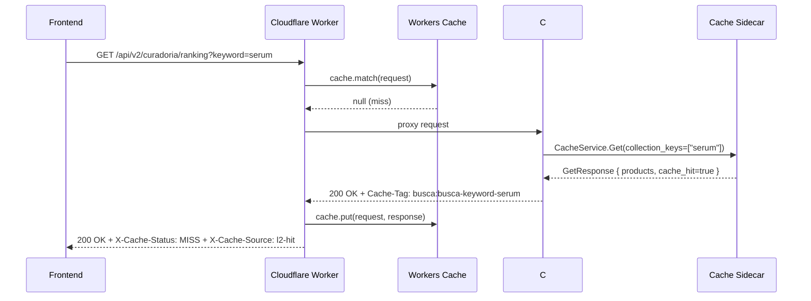
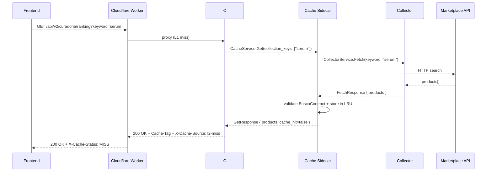
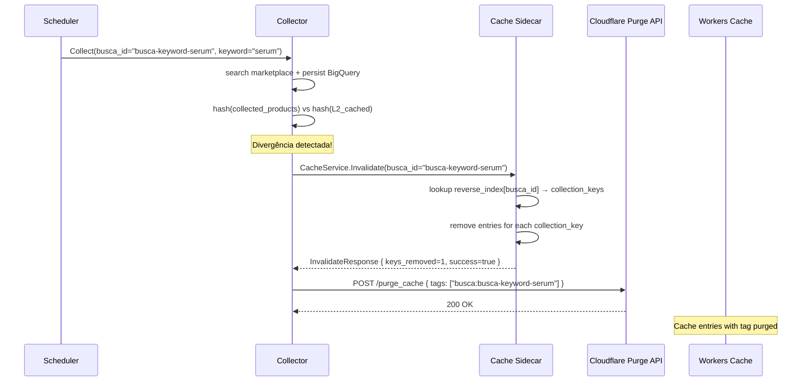

# Design Document: Cache Layer (L1 + L2)

## Overview

O sistema Garimpei realiza polling a cada 30s no frontend (dashboard realtime, ADR-0029) e coletas agendadas a cada 8h. Entre coletas, os dados de produto são estáticos — mas cada request atinge o Collector Go, que por sua vez consulta APIs externas de marketplace (Shopee, Amazon). Isso gera carga desnecessária no Collector e latência evitável para o usuário.

Este design introduz uma camada de cache em dois níveis:

- **L1 (Cloudflare Workers Cache)**: Cache HTTP no edge global. Absorve ~90% das leituras repetitivas do frontend sem atingir Cloud Run. TTL de 5 minutos, invalidação por Cache-Tag (`busca:{busca_id}`).
- **L2 (Go Cache Sidecar)**: Cache in-memory no mesmo pod Cloud Run. Protege o Collector contra thundering herd quando L1 expira simultaneamente para múltiplos usuários. TTL de 30 minutos com stale-while-revalidate.

A invalidação é event-driven: o Collector, após completar uma coleta (`Collect` RPC), compara os dados coletados com o cache L2 via hash. Se houver divergência, invalida L2 localmente e purga L1 via Cloudflare API por tag.

## Architecture



## Sequence Diagrams

### Read Path — L1 HIT



### Read Path — L1 MISS → L2 HIT



### Read Path — L1 MISS → L2 MISS → Collector



### Write/Invalidation Path



## Components and Interfaces

### Component 1: Cloudflare Workers Cache (L1)

**Purpose**: Cache HTTP no edge global que absorve leituras repetitivas do frontend sem atingir Cloud Run.

**Configuração no Worker** (`cloudflare-worker/worker.js`):
- Intercepta requests GET para `/api/*` que possuem contexto de `busca_id`
- Usa a Cache API nativa (`caches.default`) para armazenar responses
- Insere `Cache-Control: public, max-age=300` (5 minutos) na response upstream
- Insere `Cache-Tag: busca:{busca_id}` para purge granular por tag
- Insere `X-Cache-Status: HIT|MISS|BYPASS` para observabilidade
- Requests mutantes (POST, PUT, DELETE) fazem bypass completo

**Configuração no `wrangler.toml`**:
- Nenhuma configuração adicional necessária — Cache API é built-in
- Variável `CF_PURGE_TOKEN` adicionada via `wrangler secret put` para purge API

**Rotas cacheáveis**:
- `GET /api/v2/curadoria/ranking*` (busca por keyword)
- `GET /api/v2/curadoria/ranking/shop*` (busca por loja)
- `GET /api/candidatos*`
- `GET /api/lojas/novidades*`

### Component 2: Go Cache Sidecar (L2)

**Purpose**: Cache in-memory gRPC entre C# API e Collector. Protege contra thundering herd e serve como fallback quando L1 expira.

**Interface gRPC** (`cache.v1.CacheService`):
- `Get(GetRequest) → GetResponse`: Busca produtos por collection_keys
- `Invalidate(InvalidateRequest) → InvalidateResponse`: Invalida por busca_id
- `Healthz(HealthzRequest) → HealthzResponse`: Health check com métricas

**Estrutura interna**:
- LRU store: `map[string]*cacheEntry` (key = collection_key individual)
- Reverse index: `map[string][]string` (key = busca_id, value = []collection_key)
- TTL por entry: 30 minutos (soft TTL, stale-while-revalidate)
- Memória máxima: 256 MB (configurável via env `CACHE_MAX_BYTES`)
- Eviction: LRU quando limite atingido

**Deploy**: Sidecar no mesmo pod Cloud Run, porta 50055 (localhost-only).

**Validação**: Toda entry armazenada é validada contra BuscaContract JSON Schema antes da inserção. Entries inválidas são rejeitadas com `InvalidArgument`.

### Component 3: Collector (modificado)

**Purpose**: Após completar `Collect`, detecta divergência entre dados coletados e cache L2, disparando invalidação quando necessário.

**Modificações**:
1. Após `Collect` bem-sucedido, computa hash SHA-256 da lista de produtos coletados
2. Consulta L2 para obter hash dos dados cacheados para as mesmas collection_keys
3. Se hashes divergem → chama `CacheService.Invalidate` (L2) + Cloudflare Purge API (L1)
4. Se hashes iguais → nenhuma ação (dados frescos)

**Cloudflare Purge API**:
- Endpoint: `POST https://api.cloudflare.com/client/v4/zones/{zone_id}/purge_cache`
- Body: `{ "tags": ["busca:{busca_id}"] }`
- Auth: Bearer token via env `CF_PURGE_TOKEN`
- Retry: 1 tentativa após 1s em caso de falha. Após 2ª falha, skip (L1 expira via TTL)

### Component 4: C# API (modificado)

**Purpose**: Redireciona leituras de produto para o Cache Sidecar em vez de chamar Collector diretamente.

**Modificações**:
1. Novo client gRPC `CacheService.CacheServiceClient` registrado no DI
2. Endpoints `/curadoria/ranking` e `/curadoria/ranking/shop` chamam `CacheService.Get`
3. Circuit breaker: closed → open após 3 falhas → half-open após 10s
4. Fallback: se Cache Sidecar indisponível → chama Collector diretamente
5. Header `X-Cache-Source: l2-hit|l2-miss|l2-bypass` na response HTTP

## Data Models

### Model 1: Cache Entry (L2 in-memory)

```pascal
STRUCTURE CacheEntry
  collection_key: String         -- chave individual (ex: "serum", "920292999")
  products: []Product            -- mesma mensagem proto do Collector
  fetched_at: Timestamp          -- quando foi buscado do Collector
  expires_at: Timestamp          -- fetched_at + 30min (soft TTL)
  hash: String                   -- SHA-256 do products serializado
  size_bytes: Int64              -- tamanho estimado em memória
  access_count: Int64            -- contador para métricas
  last_accessed: Timestamp       -- para LRU ordering
END STRUCTURE
```

### Model 2: Reverse Index Entry

```pascal
STRUCTURE ReverseIndexEntry
  busca_id: String               -- UUID da busca
  collection_keys: []String      -- todas as keys associadas a esta busca
  registered_at: Timestamp       -- quando a associação foi registrada
END STRUCTURE
```

### Model 3: Invalidation Event (log estruturado)

```pascal
STRUCTURE InvalidationEvent
  busca_id: String
  collection_keys: []String
  trigger: ENUM("divergence", "manual", "ttl_expired")
  l2_keys_removed: Int32
  l1_purge_success: Boolean
  l1_purge_latency_ms: Int64
  staleness_seconds: Int64       -- tempo entre último write e invalidação
  timestamp: Timestamp
END STRUCTURE
```

### Model 4: Proto Messages (cache.v1)

```pascal
STRUCTURE GetRequest
  collection_keys: []String      -- keys derivadas via DeriveCollectionKeys
  busca_id: String               -- para registrar no reverse index
  marketplace: Marketplace       -- SHOPEE | AMAZON | MERCADOLIVRE
END STRUCTURE

STRUCTURE GetResponse
  products: []Product            -- reutiliza collector.v1.Product
  cache_hit: Boolean             -- true se servido do cache
  fetched_at: String             -- RFC3339 timestamp
  schema_version: String         -- versão do BuscaContract usado na validação
END STRUCTURE

STRUCTURE InvalidateRequest
  busca_id: String               -- invalida todas as keys associadas
  collection_keys: []String      -- invalidação granular (opcional)
END STRUCTURE

STRUCTURE InvalidateResponse
  keys_removed: Int32
  success: Boolean
END STRUCTURE

STRUCTURE HealthzRequest {}

STRUCTURE HealthzResponse
  ready: Boolean
  cache_size_bytes: Int64
  hits_total: Int64
  misses_total: Int64
  entries_count: Int64
END STRUCTURE
```

## Algorithmic Pseudocode

### Algorithm 1: Cache Get (L2)

```pascal
ALGORITHM CacheGet(request)
INPUT: request of type GetRequest { collection_keys, busca_id, marketplace }
OUTPUT: GetResponse

BEGIN
  -- Registrar reverse index para invalidação futura
  reverseIndex[request.busca_id] ← UNION(reverseIndex[request.busca_id], request.collection_keys)

  -- Verificar se TODAS as keys estão no cache
  allHit ← TRUE
  products ← empty list

  FOR EACH key IN request.collection_keys DO
    entry ← lruStore.Get(key)
    IF entry IS NULL OR entry.expires_at < NOW() THEN
      allHit ← FALSE
      BREAK
    END IF
    products ← APPEND(products, entry.products)
  END FOR

  IF allHit THEN
    metrics.hits_total++
    RETURN GetResponse { products, cache_hit=true, fetched_at=entry.fetched_at }
  END IF

  -- Cache miss: fetch do Collector
  metrics.misses_total++
  
  -- Singleflight: coalesce requests concorrentes para mesmas keys
  response ← singleflight.Do(HASH(request.collection_keys), FUNC() {
    CASE request.marketplace
      WHEN keyword-based:
        FOR EACH key IN request.collection_keys DO
          resp ← collector.Fetch(keyword=key, marketplace=request.marketplace)
          products ← APPEND(products, resp.products)
        END FOR
      WHEN shop-based:
        FOR EACH key IN request.collection_keys DO
          shopId ← ParseInt64(key)
          IF shopId > 0 THEN
            resp ← collector.FetchShop(shop_id=shopId, marketplace=request.marketplace)
            products ← APPEND(products, resp.products)
          ELSE
            resp ← collector.Fetch(keyword=key, marketplace=request.marketplace)
            products ← APPEND(products, resp.products)
          END IF
        END FOR
    END CASE
    RETURN products
  })

  -- Validar contra BuscaContract antes de armazenar
  IF NOT validateBuscaContract(response) THEN
    log.Error("validation failed", busca_id=request.busca_id)
    RETURN error(InvalidArgument, "BuscaContract validation failed")
  END IF

  -- Armazenar no cache (LRU evict se necessário)
  hash ← SHA256(serialize(response))
  FOR EACH key IN request.collection_keys DO
    entry ← CacheEntry {
      collection_key: key,
      products: filterByKey(response, key),
      fetched_at: NOW(),
      expires_at: NOW() + 30min,
      hash: hash,
      size_bytes: estimateSize(response)
    }
    lruStore.Put(key, entry)  -- evicts LRU if over 256MB
  END FOR

  RETURN GetResponse { products=response, cache_hit=false, fetched_at=NOW() }
END
```

### Algorithm 2: Cache Invalidate

```pascal
ALGORITHM CacheInvalidate(request)
INPUT: request of type InvalidateRequest { busca_id, collection_keys }
OUTPUT: InvalidateResponse

BEGIN
  keysToRemove ← empty set

  -- Se busca_id fornecido, usar reverse index
  IF request.busca_id ≠ "" THEN
    keysToRemove ← reverseIndex[request.busca_id]
    DELETE reverseIndex[request.busca_id]
  END IF

  -- Se collection_keys explícitas fornecidas, adicionar
  IF LENGTH(request.collection_keys) > 0 THEN
    keysToRemove ← UNION(keysToRemove, request.collection_keys)
  END IF

  removed ← 0
  FOR EACH key IN keysToRemove DO
    IF lruStore.Delete(key) THEN
      removed++
    END IF
  END FOR

  metrics.invalidations_total += removed

  log.Info("cache invalidated",
    busca_id=request.busca_id,
    keys_removed=removed,
    collection_keys=keysToRemove)

  RETURN InvalidateResponse { keys_removed=removed, success=true }
END
```

### Algorithm 3: Divergence Detection (Collector)

```pascal
ALGORITHM DetectDivergence(busca_id, collection_keys, collected_products)
INPUT: busca_id String, collection_keys []String, collected_products []Product
OUTPUT: diverged Boolean

BEGIN
  -- Computar hash dos dados recém-coletados
  newHash ← SHA256(canonicalSerialize(sortByItemId(collected_products)))

  -- Obter hash do cache L2 atual
  cachedHash ← ""
  FOR EACH key IN collection_keys DO
    entry ← cacheClient.GetEntry(key)  -- internal: busca entry sem side-effects
    IF entry IS NOT NULL THEN
      cachedHash ← entry.hash
      BREAK
    END IF
  END FOR

  -- Comparar
  IF cachedHash = "" THEN
    -- Nada no cache, não é divergência (é cold start)
    RETURN FALSE
  END IF

  IF newHash ≠ cachedHash THEN
    log.Info("divergence detected",
      busca_id=busca_id,
      old_hash=cachedHash[:8],
      new_hash=newHash[:8])
    RETURN TRUE
  END IF

  RETURN FALSE
END
```

### Algorithm 4: LRU Eviction

```pascal
ALGORITHM LRUEvict(newEntrySize)
INPUT: newEntrySize of type Int64
OUTPUT: void (side-effect: entries evicted from store)

BEGIN
  WHILE currentSizeBytes + newEntrySize > MAX_CACHE_BYTES DO
    -- Encontrar entry com last_accessed mais antigo
    oldest ← lruList.Back()  -- doubly-linked list, O(1) access
    IF oldest IS NULL THEN
      BREAK  -- cache vazio, nada a evictar
    END IF

    lruStore.Delete(oldest.collection_key)
    currentSizeBytes -= oldest.size_bytes
    lruList.Remove(oldest)

    metrics.evictions_total++
    log.Debug("evicted", key=oldest.collection_key, size=oldest.size_bytes)
  END WHILE
END
```

### Algorithm 5: Circuit Breaker (C# API)

```pascal
ALGORITHM CircuitBreakerCall(operation)
INPUT: operation of type Func<Task<T>>
OUTPUT: T or fallback

STATE:
  state: ENUM(CLOSED, OPEN, HALF_OPEN) = CLOSED
  failure_count: Int = 0
  last_failure_at: Timestamp = 0
  FAILURE_THRESHOLD: Int = 3
  RECOVERY_TIMEOUT: Duration = 10s

BEGIN
  CASE state
    WHEN CLOSED:
      TRY
        result ← AWAIT operation()
        failure_count ← 0
        RETURN result
      CATCH (timeout OR connection_refused):
        failure_count++
        last_failure_at ← NOW()
        IF failure_count >= FAILURE_THRESHOLD THEN
          state ← OPEN
          log.Warn("circuit breaker opened", failures=failure_count)
        END IF
        RETURN fallbackToCollector()
      END TRY

    WHEN OPEN:
      IF NOW() - last_failure_at >= RECOVERY_TIMEOUT THEN
        state ← HALF_OPEN
        -- Fall through to HALF_OPEN
      ELSE
        RETURN fallbackToCollector()
      END IF

    WHEN HALF_OPEN:
      TRY
        result ← AWAIT operation()
        state ← CLOSED
        failure_count ← 0
        log.Info("circuit breaker closed (recovered)")
        RETURN result
      CATCH:
        state ← OPEN
        last_failure_at ← NOW()
        RETURN fallbackToCollector()
      END TRY
  END CASE
END
```

## Key Functions with Formal Specifications

### Function 1: CacheService.Get

```pascal
PROCEDURE CacheService.Get(req: GetRequest) → GetResponse
```

**Preconditions:**
- `req.collection_keys` é não-vazio (pelo menos 1 key)
- Cada key em `req.collection_keys` é string não-vazia e normalizada (lowercase, trimmed)
- `req.busca_id` é string não-vazia
- `req.marketplace` é um valor válido do enum Marketplace

**Postconditions:**
- Se cache hit: `response.products` contém os mesmos dados armazenados, `response.cache_hit = true`
- Se cache miss: `response.products` contém dados frescos do Collector, entry é armazenada no LRU
- `response.fetched_at` é sempre preenchido (RFC3339)
- `response.schema_version` reflete a versão do BuscaContract usada na validação
- O reverse index `busca_id → collection_keys` é atualizado atomicamente
- Função é thread-safe (sync.RWMutex no LRU store)

**Invariants:**
- Total size of all entries ≤ MAX_CACHE_BYTES (256 MB default)
- Entries retornadas sempre passaram validação BuscaContract

### Function 2: CacheService.Invalidate

```pascal
PROCEDURE CacheService.Invalidate(req: InvalidateRequest) → InvalidateResponse
```

**Preconditions:**
- `req.busca_id` é string não-vazia OU `req.collection_keys` é não-vazio (ao menos um)
- Se `req.busca_id` fornecido, o reverse index pode ou não conter uma entrada

**Postconditions:**
- Todas as entries associadas ao `busca_id` (via reverse index) são removidas do LRU
- Todas as entries para `collection_keys` explícitas são removidas do LRU
- `response.keys_removed` reflete o número real de entries removidas (0 se nenhuma existia)
- `response.success = true` sempre (operação idempotente)
- `currentSizeBytes` é decrementado corretamente
- Operação completa em < 1ms (target: local memory only)

### Function 3: Divergence Check (Collector)

```pascal
PROCEDURE DetectAndInvalidate(busca_id: String, keys: []String, products: []Product) → void
```

**Preconditions:**
- `busca_id` é não-vazio
- `keys` = resultado de `DeriveCollectionKeys` para a busca
- `products` é o resultado fresco da coleta (pode ser vazio se marketplace retornou 0)
- Collector já completou `Collect` com sucesso (BigQuery persist aceito)

**Postconditions:**
- Se hash(products) ≠ hash(cached): L2 invalidado + L1 purge tentado
- Se hash(products) = hash(cached): nenhuma ação (cache permanece válido)
- Se L2 indisponível: log warning, continua sem bloquear
- Se L1 purge falha após retry: log warning, skip (L1 expira via TTL)
- Nunca bloqueia o response do `Collect` RPC ao caller (Scheduler)

## Proto Definition

Arquivo: `protos/cache/v1/cache.proto`

```protobuf
syntax = "proto3";

package cache.v1;

option go_package = "github.com/fmarquesfilho/garimpo/gen/go/cache/v1;cachev1";
option csharp_namespace = "Garimpei.Protos.Cache.V1";

import "collector/v1/collector.proto";

// CacheService fornece cache in-memory para dados de produto.
// Deploy: sidecar no mesmo pod Cloud Run (localhost:50055).
service CacheService {
  // Get busca produtos por collection_keys. Cache miss dispara fetch ao Collector.
  rpc Get(GetRequest) returns (GetResponse);
  // Invalidate remove entries do cache por busca_id e/ou collection_keys.
  rpc Invalidate(InvalidateRequest) returns (InvalidateResponse);
  // Healthz retorna status e métricas do cache para health probes e circuit breaker.
  rpc Healthz(HealthzRequest) returns (HealthzResponse);
}

message GetRequest {
  // Collection keys derivadas via DeriveCollectionKeys (sorted, normalized).
  repeated string collection_keys = 1;
  // UUID da busca — usado para registrar no reverse index.
  string busca_id = 2;
  // Marketplace para direcionar o fetch em caso de miss.
  collector.v1.Marketplace marketplace = 3;
}

message GetResponse {
  // Produtos encontrados (mesma mensagem do Collector).
  repeated collector.v1.Product products = 1;
  // True se todos os collection_keys estavam no cache.
  bool cache_hit = 2;
  // Timestamp RFC3339 de quando os dados foram obtidos.
  string fetched_at = 3;
  // Versão do BuscaContract JSON Schema usada na validação.
  string schema_version = 4;
}

message InvalidateRequest {
  // UUID da busca — invalida todas as keys no reverse index.
  string busca_id = 1;
  // Collection keys explícitas para invalidação granular (opcional).
  repeated string collection_keys = 2;
}

message InvalidateResponse {
  // Número de entries removidas do cache.
  int32 keys_removed = 1;
  // Sempre true (operação idempotente).
  bool success = 2;
}

message HealthzRequest {}

message HealthzResponse {
  // True quando o cache está pronto para receber requests.
  bool ready = 1;
  // Tamanho atual do cache em bytes.
  int64 cache_size_bytes = 2;
  // Total de cache hits desde o boot.
  int64 hits_total = 3;
  // Total de cache misses desde o boot.
  int64 misses_total = 4;
  // Número de entries atualmente no cache.
  int64 entries_count = 5;
}
```

## Error Handling

### Error Scenario 1: L2 Cache Sidecar Unavailable

**Condition**: gRPC connection refused ou timeout (> 500ms) ao chamar `CacheService.Get`
**Response**: C# API circuit breaker abre. Requests são roteadas diretamente para `CollectorService.Fetch`/`FetchShop`.
**Recovery**: Circuit breaker tenta half-open após 10s. Se `Healthz` responde OK, fecha o circuito.
**Observabilidade**: Log warning (rate-limited 1/min), header `X-Cache-Source: l2-bypass`.

### Error Scenario 2: L1 Purge API Fails

**Condition**: Cloudflare Purge API retorna erro (5xx, timeout, network error)
**Response**: Collector faz 1 retry após 1s de delay. Se retry também falha, skip e log warning.
**Recovery**: L1 expira naturalmente via TTL (max-age=300s). Dados ficam stale por no máximo 5 minutos.
**Observabilidade**: Log com `l1_purge_success=false`, métrica `cache_l1_purge_failures_total`.

### Error Scenario 3: BuscaContract Validation Failure

**Condition**: Dados retornados pelo Collector não passam validação do JSON Schema
**Response**: Entry NÃO é armazenada no cache. Request retorna `InvalidArgument` gRPC status.
**Recovery**: Caller (C# API) pode retry ou fazer fallback direto ao Collector (sem cache).
**Observabilidade**: Log error com detalhes da validação, métrica `cache_validation_failures_total`.

### Error Scenario 4: Thundering Herd (L2 miss simultâneo)

**Condition**: L1 expira para uma busca popular. Múltiplos requests chegam simultaneamente ao L2 com as mesmas collection_keys.
**Response**: Singleflight coalesce requests concorrentes — apenas 1 chamada ao Collector é feita. Demais requests aguardam o resultado.
**Recovery**: Após o primeiro response, entry é armazenada no cache. Requests subsequentes são cache hits.
**Observabilidade**: Métrica `cache_coalesced_requests_total`.

### Error Scenario 5: Cache Full (256 MB limit)

**Condition**: Nova entry precisa de espaço e o cache já está no limite
**Response**: LRU eviction remove a entry com `last_accessed` mais antigo até haver espaço.
**Recovery**: Automática. Entries evictadas serão re-fetched on demand.
**Observabilidade**: Métrica `cache_evictions_total`, log debug com key evictada.

### Error Scenario 6: Collector Unreachable from L2

**Condition**: L2 tenta fetch ao Collector durante cache miss, mas Collector está down
**Response**: L2 propaga o erro gRPC (Unavailable) ao C# API. C# trata via circuit breaker.
**Recovery**: C# API pode tentar fallback direto (improvável — mesmo pod). Se tudo falha, retorna empty response ao frontend (nunca HTTP 500).
**Observabilidade**: Log error, gRPC status propagado.

## Testing Strategy

### Unit Tests

**Go Cache Sidecar** (`services/cache/server_test.go`):
- `TestGet_CacheHit`: Pré-popula entry, verifica retorno imediato sem chamar Collector
- `TestGet_CacheMiss_FetchesFromCollector`: Verifica chamada ao Collector mock e armazenamento
- `TestGet_ValidationFailure_RejectsEntry`: Dados inválidos não entram no cache
- `TestInvalidate_RemovesByBuscaId`: Verifica remoção via reverse index
- `TestInvalidate_Idempotent`: Invalidar busca inexistente retorna success=true, keys_removed=0
- `TestLRU_EvictsOldest`: Com limite baixo, verifica que entries antigas são evictadas
- `TestSingleflight_CoalescesRequests`: Requests concorrentes resultam em 1 chamada ao Collector
- `TestTTL_Expires_FetchesAgain`: Após 30min, entry é refetched

**Go Collector** (`services/collector/divergence_test.go`):
- `TestDivergence_Detected_InvalidatesCache`: Hash diferente → InvalidateRequest enviado
- `TestDivergence_NotDetected_NoAction`: Hash igual → nenhuma chamada
- `TestPurgeAPI_Retry_OnFailure`: Mock API falha 1x → retry → success
- `TestPurgeAPI_SkipAfterRetry`: Mock API falha 2x → skip com log

**C# API** (`src/Garimpei.Api.Tests/CacheIntegrationTests.cs`):
- `TestCacheGet_Success_ReturnsCachedData`: Mock gRPC retorna hit
- `TestCacheGet_Unavailable_FallsBackToCollector`: Connection refused → Collector direto
- `TestCircuitBreaker_Opens_After3Failures`: 3 timeouts → state OPEN
- `TestCircuitBreaker_HalfOpen_After10s`: Timer expira → tenta 1 request
- `TestDeriveCollectionKeys_MatchesGoImplementation`: Fixtures cross-language

### Integration Tests

**Cache ↔ Collector** (local, via `mise run test:integration:cache`):
- Start cache sidecar + collector mock
- Send GetRequest → verify Collector is called on miss
- Send GetRequest again → verify Collector NOT called (hit)
- Send InvalidateRequest → verify next Get calls Collector

**Invalidation E2E** (local, via `mise run test:e2e:cache-invalidation`):
- Trigger Collect → verify L2 invalidated → verify new Get returns fresh data

### Cross-Language Fixture Tests

Reutiliza `fixtures/buscas.json` para validar que `DeriveCollectionKeys` produz as mesmas cache keys em Go e C#. Já existente no CI (`mise run check:fixtures-crosslang`).

### Performance Tests (local only)

- `BenchmarkCacheGet_Hit`: Target < 0.1ms (100μs)
- `BenchmarkCacheGet_Miss`: Target < latência Collector + 1ms overhead
- `BenchmarkLRU_Eviction_Under256MB`: Verify no OOM com 256MB budget
- `BenchmarkSingleflight_100Concurrent`: Verify 1 Collector call for 100 parallel Gets

## Performance Considerations

### Latency Targets

| Camada | Cenário | Target | Medição |
|--------|---------|--------|---------|
| L1 | Cache HIT (edge) | < 5ms | Cloudflare Worker analytics |
| L2 | Cache HIT (in-memory) | < 0.1ms (100μs) | gRPC interceptor histogram |
| L2 | Cache MISS (inclui Collector) | < Collector latency + 1ms | gRPC interceptor |
| Invalidation | L2 local | < 1ms | Invalidate RPC latency |
| Invalidation | L1 purge (HTTP) | < 100ms | Collector log |

### Memory Budget

- **L2 máximo**: 256 MB (configurável via `CACHE_MAX_BYTES`)
- **Estimativa por entry**: ~5 KB (50 produtos × 100 bytes/produto)
- **Entries estimadas**: 256MB / 5KB ≈ 51.200 entries
- **Buscas típicas por tenant**: ~20 buscas × 3 collection_keys = 60 entries
- **Capacidade estimada**: ~850 tenants com cache quente simultâneo

### Hit Rate Target

- **L1 target**: > 90% (frontend polls a cada 30s, TTL 5min = 10 hits por TTL window)
- **L2 target**: > 80% (dados mudam a cada 8h, TTL 30min = 16 hits por TTL window)
- **Combined**: > 95% das requests nunca atingem o Collector

### Singleflight

- Previne thundering herd: quando L1 expira, até N requests concorrentes para mesma key resultam em 1 chamada ao Collector
- Implementação: `golang.org/x/sync/singleflight` (stdlib-adjacent, já no go.mod do projeto)

### Cache Warm-up

- **Decisão: sem pre-warming**. Cache é populado lazily no primeiro request.
- Justificativa: dados mudam a cada 8h, cold start após deploy (< 1min) é aceitável. Pre-warming adicionaria complexidade sem benefício mensurável.

## Security Considerations

### Tenant Isolation no Cache

- Cache keys são collection_keys individuais (ex: "serum", "920292999") — não contêm owner_uid
- **Risco**: Dois tenants com a mesma keyword poderiam compartilhar cache entries
- **Mitigação**: Cache key DEVE incluir owner_uid como prefixo: `{owner_uid}:{collection_key}`
- Reverse index: `{owner_uid}:{busca_id}` → `[{owner_uid}:key1, {owner_uid}:key2]`
- Validação de tenant: C# API valida owner_uid via JWT ANTES de chamar CacheService

### Cloudflare API Token Management

- Token para Purge API armazenado como Secret no Cloud Run: `CF_PURGE_TOKEN`
- Escopo mínimo: Zone > Cache Purge (Custom Hostnames) only
- Rotação: via `gcloud secrets versions add` (não requer redeploy — env var resolve latest)
- Nunca logado em plaintext — masked em structured logs

### Cache Poisoning Prevention

- Toda entry armazenada é validada contra BuscaContract JSON Schema
- Dados que não passam validação NUNCA entram no cache
- Hash SHA-256 garante integridade: divergence detection compara hashes, não payloads

### Rate Limiting da Purge API

- Cloudflare permite 1.000 purge requests/min por zona
- Com ~100 buscas ativas e coleta a cada 8h: ~12 purges/hora (bem dentro do limite)
- Mesmo cenário extremo (todas as buscas divergem ao mesmo tempo): 100 purges < 1.000 limit

## Dependencies

### Pacotes Reutilizados (já no projeto)

| Pacote | Uso |
|--------|-----|
| `golang.org/x/sync/singleflight` | Coalesce requests concorrentes no L2 |
| `google.golang.org/grpc` | Server e client gRPC |
| `encoding/json` | Serialização para validação BuscaContract |
| `crypto/sha256` | Hash para divergence detection |
| `container/list` | Doubly-linked list para LRU |
| `sync` | RWMutex para thread-safety |
| `net/http` | Client HTTP para Cloudflare Purge API |
| `Grpc.Net.Client` (C#) | Client gRPC para CacheService |

### Nenhuma Dependência Nova

- LRU implementado com stdlib (`container/list` + `sync.Map`)
- JSON Schema validation: reusa lógica existente (Go: `xeipuuv/gojsonschema` já no go.mod)
- Singleflight: já presente como dependência transitiva (`golang.org/x/sync`)
- Circuit breaker no C#: implementação manual (padrão simples, sem Polly — mantém zero deps novas)

## Deployment

### Cloud Run Multi-Container (Pod)

O Cache Sidecar é adicionado como container extra no mesmo pod (padrão existente do projeto):

```yaml
# deploy/cloud-run-deploy-now.yaml (trecho)
apiVersion: serving.knative.dev/v1
kind: Service
spec:
  template:
    spec:
      containers:
        # Container principal (C# API)
        - image: REGISTRY/garimpei-api-v2:latest
          ports:
            - containerPort: 8080
          env:
            - name: CACHE_GRPC_ADDRESS
              value: "localhost:50055"

        # Collector (sidecar existente)
        - image: REGISTRY/collector:latest
          ports:
            - containerPort: 50051
          env:
            - name: CACHE_GRPC_ADDRESS
              value: "localhost:50055"
            - name: CF_PURGE_TOKEN
              valueFrom:
                secretKeyRef:
                  name: CF_PURGE_TOKEN
            - name: CF_ZONE_ID
              value: "ZONE_ID_GARIMPEI"

        # Cache Sidecar (NOVO)
        - image: REGISTRY/cache-sidecar:latest
          ports:
            - containerPort: 50055
          env:
            - name: CACHE_MAX_BYTES
              value: "268435456"  # 256 MB
            - name: CACHE_TTL_SECONDS
              value: "1800"  # 30 minutos
            - name: COLLECTOR_GRPC_ADDRESS
              value: "localhost:50051"
          resources:
            limits:
              memory: 512Mi  # 256MB cache + overhead
              cpu: 500m
          startupProbe:
            grpc:
              port: 50055
              service: cache.v1.CacheService
            initialDelaySeconds: 1
            periodSeconds: 2
```

### Dockerfile do Cache Sidecar

```dockerfile
# services/cache/Dockerfile
FROM golang:1.24-alpine AS builder
WORKDIR /app
COPY go.mod go.sum ./
RUN go mod download
COPY . .
RUN CGO_ENABLED=0 go build -o /cache-sidecar ./services/cache

FROM alpine:3.21
RUN apk add --no-cache ca-certificates
COPY --from=builder /cache-sidecar /cache-sidecar
COPY contracts/schemas/busca-contract.json /schemas/busca-contract.json
EXPOSE 50055
ENTRYPOINT ["/cache-sidecar"]
```

### wrangler.toml Changes

```toml
# cloudflare-worker/wrangler.toml (adições)
[vars]
V2_ENABLED = "true"
V1_ORIGIN = "https://garimpo-api-vj6afttbza-rj.a.run.app"
PAGES_URL = "https://garimpei-web.pages.dev"
DOCS_URL = "https://garimpei-docs.pages.dev"
# CF_PURGE_TOKEN — set via: wrangler secret put CF_PURGE_TOKEN
# Não necessário no Worker (purge é feito pelo Collector, não pelo Worker)

# Cache config (controla quais rotas o Worker cacheia)
CACHE_ROUTES = "/api/v2/curadoria/ranking,/api/v2/curadoria/ranking/shop,/api/candidatos,/api/lojas/novidades"
CACHE_MAX_AGE = "300"
```

### CI Pipeline Changes

Adicionar build do cache-sidecar ao job `deploy-backend`:

```yaml
# .github/workflows/ci.yml (adição ao build_image parallel)
build_image cache-sidecar services/cache/Dockerfile . &
pids+=($!)
```

### Registry Update

Adicionar ao `contracts/registry.yaml`:

```yaml
services:
  - id: cache-sidecar
    name: "Cache Sidecar (Go)"
    runtime: cloud-run-sidecar
    port: 50055
    proto: protos/cache/v1/cache.proto

boundaries:
  - id: api-cache-get
    source: csharp-api
    target: cache-sidecar
    protocol: grpc
    service: cache.v1.CacheService
    method: Get
    notes: "Substituição de CollectorService.Fetch/FetchShop para leituras cacheadas."

  - id: collector-cache-invalidate
    source: collector
    target: cache-sidecar
    protocol: grpc
    service: cache.v1.CacheService
    method: Invalidate
    notes: "Divergence-driven invalidation após Collect."
```

## Correctness Properties

### Property 1: Cache Get nunca retorna dados sem validação

*For any* `GetRequest` que resulta em cache miss e fetch do Collector, os dados armazenados no LRU SHALL ter passado validação BuscaContract. Se a validação falha, a entry NÃO é armazenada e o request retorna erro.

**Validates: Requirement 3.1, 3.2**

### Property 2: Invalidate é idempotente

*For any* `InvalidateRequest`, chamá-lo N vezes com o mesmo busca_id SHALL produzir o mesmo estado final (entries removidas). A segunda chamada retorna `keys_removed=0, success=true`.

**Validates: Requirement 4.3**

### Property 3: Reverse index é consistente com LRU store

*For any* estado do cache, se `reverseIndex[busca_id]` contém `key`, então `lruStore[key]` existe OU foi evictado (nesse caso, reverseIndex é stale mas inofensivo — Invalidate simplesmente retorna 0).

**Validates: Requirement 4.3, 2.4**

### Property 4: Divergence detection é sound (never misses real changes)

*For any* `Collect` que produz dados diferentes dos dados no cache L2 para as mesmas collection_keys, `DetectDivergence` SHALL retornar `true` e disparar invalidação.

**Validates: Requirement 4.1, 4.2**

### Property 5: Circuit breaker eventual recovery

*For any* sequência onde o Cache Sidecar se torna indisponível e depois se recupera, o circuit breaker SHALL transicionar de OPEN para HALF_OPEN (após 10s) e depois para CLOSED (após 1 request bem-sucedido), restaurando o uso do cache.

**Validates: Requirement 6.3**

### Property 6: L2 invalidation precedes L1 purge

*For any* divergence event, a invalidação do L2 (gRPC local, < 1ms) SHALL completar ANTES do início da chamada L1 purge (HTTP, < 100ms). Isso garante que requests que passam L1 purge mas atingem L2 vejam dados frescos.

**Validates: Requirement 4.6**

### Property 7: Cache keys derivados identicamente em Go e C#

*For any* BuscaContract válido, `DeriveCollectionKeys` em Go e C# SHALL produzir arrays idênticos (mesmos elementos, mesma ordem).

**Validates: Requirement 8.1, 8.2, 8.3**

### Property 8: Singleflight coalesce garante 1 fetch por key-set

*For any* N requests concorrentes com as mesmas `collection_keys` durante um cache miss, o Collector SHALL ser chamado exatamente 1 vez. Todos os N callers recebem o mesmo resultado.

**Validates: Requirement 2 (thundering herd protection)**

### Property 9: Graceful degradation — nunca HTTP 500

*For any* combinação de falhas (L2 down + Collector down), o C# API SHALL retornar um response HTTP estruturado (200 com empty data, ou 503 com retry-after), NUNCA um HTTP 500 unhandled.

**Validates: Requirement 5.3, 6.1, 6.2**

### Property 10: TTL expiration triggers re-fetch

*For any* cache entry com `expires_at < NOW()`, um `Get` request para essa key SHALL tratar como miss e re-fetch do Collector, atualizando `expires_at` para `NOW() + TTL`.

**Validates: Requirement 2.3 (stale-while-revalidate implicit)**

### Property 11: LRU eviction respects memory budget

*For all* states of the cache, `sum(entry.size_bytes for entry in lruStore) ≤ MAX_CACHE_BYTES`. Inserir uma entry que excederia o limite SHALL evictar entries LRU até haver espaço.

**Validates: Requirement 2.6**

### Property 12: Cache-Tag always present on cacheable responses

*For any* cacheable HTTP response (GET on CACHE_ROUTES), the Cloudflare Worker SHALL include `Cache-Tag: busca:{busca_id}` header, enabling tag-based purge.

**Validates: Requirement 1.3**
