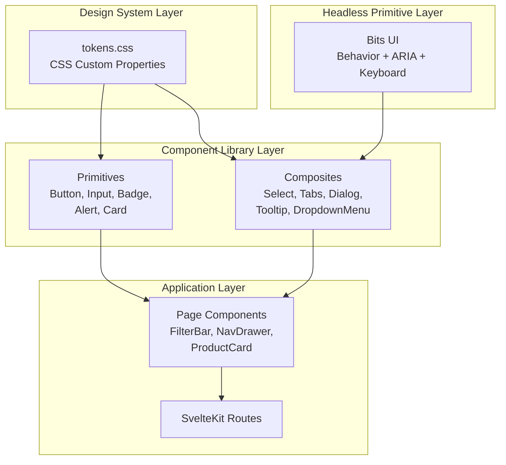
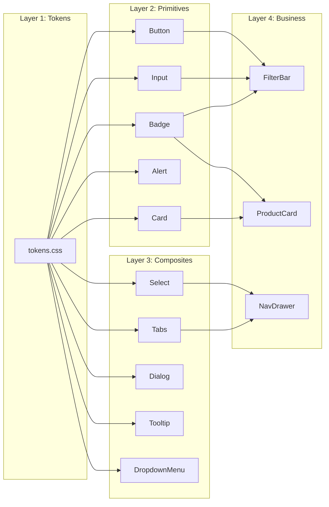
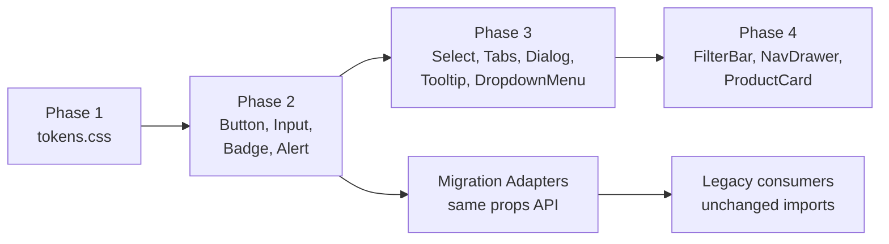

# Design Document: Component Library Refactor

## Overview

This design describes the refactoring of Garimpo's frontend component library from ad-hoc utility-class-based components to a structured, accessible architecture built on Bits UI headless primitives and a formalized design token system.

The core idea: Bits UI provides interaction behavior and ARIA semantics (keyboard nav, focus management, roles); our wrapper components apply the Garimpo visual identity exclusively through CSS custom properties. The existing `app.css` token values remain unchanged — we formalize them into a structured token file and reference them consistently across all components.

### Key Design Decisions

1. **Bits UI as headless layer** — chosen for Svelte 5 runes compatibility, compound component API, built-in WCAG compliance, and zero styling opinions (see ADR for alternatives evaluation)
2. **CSS custom properties only** — no CSS-in-JS, no Tailwind; tokens stay as `:root` variables styled via scoped `<style>` blocks and `data-*` attribute selectors
3. **Progressive migration** — new components coexist with legacy via scoped styles; Migration_Adapters maintain backward compatibility during transition
4. **Single-file components** — each component is one `.svelte` file with `$props()` runes, scoped CSS, and Bits UI composition

## Architecture

### System Architecture Diagram



### Component Layering



### Migration Flow



## Components and Interfaces

### File Structure

```
web/src/lib/components/ui/
├── tokens.css              # Formalized design tokens (Phase 1)
├── Button.svelte           # Primitive — styled wrapper
├── Input.svelte            # Primitive — styled wrapper
├── Badge.svelte            # Primitive — styled wrapper
├── Alert.svelte            # Primitive — styled wrapper
├── Card.svelte             # Primitive — styled wrapper
├── Select.svelte           # Composite — wraps Bits UI Select
├── Tabs.svelte             # Composite — wraps Bits UI Tabs
├── Dialog.svelte           # Composite — wraps Bits UI Dialog
├── Tooltip.svelte          # Composite — wraps Bits UI Tooltip
├── DropdownMenu.svelte     # Composite — wraps Bits UI DropdownMenu
└── index.js                # Barrel export
```

### Component Interfaces

#### Button

```svelte
<script>
  let {
    variant = 'primary',   // 'primary' | 'secondary' | 'danger' | 'ghost'
    size = 'md',           // 'sm' | 'md' | 'lg'
    disabled = false,
    type = 'button',       // 'button' | 'submit' | 'reset'
    onclick = null,
    children,
    ...rest
  } = $props();
</script>
```

#### Input

```svelte
<script>
  let {
    value = $bindable(''),
    type = 'text',
    placeholder = '',
    label = '',
    variant = 'default',   // 'default' | 'mono'
    size = 'md',           // 'sm' | 'md' | 'lg'
    disabled = false,
    ...rest
  } = $props();
</script>
```

#### Select (Bits UI)

```svelte
<script>
  import { Select as BitsSelect } from 'bits-ui';

  let {
    value = $bindable(''),
    label = '',
    options = [],          // { value: string, label: string }[]
    placeholder = '',
    size = 'md',
    disabled = false,
    ...rest
  } = $props();
</script>

<!-- Wraps BitsSelect.Root > Trigger > Content > Item -->
```

#### Dialog (Bits UI)

```svelte
<script>
  import { Dialog as BitsDialog } from 'bits-ui';

  let {
    open = $bindable(false),
    title = '',
    description = '',
    children,
    ...rest
  } = $props();
</script>

<!-- Wraps BitsDialog.Root > Portal > Overlay > Content > Title > Description > Close -->
```

#### Tabs (Bits UI)

```svelte
<script>
  import { Tabs as BitsTabs } from 'bits-ui';

  let {
    tabs = [],             // { id: string, label: string, badge?: string }[]
    active = $bindable(''),
    children,
    ...rest
  } = $props();
</script>

<!-- Wraps BitsTabs.Root > List > Trigger + Content panels -->
```

#### Tooltip (Bits UI)

```svelte
<script>
  import { Tooltip as BitsTooltip } from 'bits-ui';

  let {
    content = '',
    side = 'top',          // 'top' | 'bottom' | 'left' | 'right'
    children,
    ...rest
  } = $props();
</script>

<!-- Wraps BitsTooltip.Root > Trigger > Content -->
```

#### DropdownMenu (Bits UI)

```svelte
<script>
  import { DropdownMenu as BitsDropdown } from 'bits-ui';

  let {
    items = [],            // { label: string, onclick: () => void, disabled?: boolean }[]
    children,              // trigger content
    ...rest
  } = $props();
</script>

<!-- Wraps BitsDropdown.Root > Trigger > Content > Item -->
```

#### Badge

```svelte
<script>
  let {
    variant = 'default',   // 'default' | 'gold' | 'pink' | 'green' | 'red'
    children,
    ...rest
  } = $props();
</script>
```

#### Alert

```svelte
<script>
  let {
    variant = 'error',     // 'error' | 'success' | 'warning'
    inline = false,
    children,
    ...rest
  } = $props();
</script>
```

#### Card

```svelte
<script>
  let {
    variant = 'default',   // 'default' | 'highlight' | 'success' | 'error'
    padding = 'md',        // 'sm' | 'md' | 'lg'
    children,
    ...rest
  } = $props();
</script>
```

### Bits UI Integration Pattern

All composite components follow the same wrapping pattern:

1. Import Bits UI primitive (compound component namespace)
2. Compose the compound sub-components in the template
3. Apply Garimpo tokens via scoped CSS targeting `data-*` attributes
4. Forward `...rest` props to the root element
5. Expose `$bindable` state props for two-way binding

Example pattern for styling via data attributes:

```css
/* Inside <style> — scoped to component */
:global([data-select-trigger]) {
  font-family: var(--ui);
  padding: var(--r3) var(--r4);
  border: 1px solid var(--linha);
  border-radius: var(--raio-sm);
  background: var(--porcelana);
  color: var(--tinta);
  transition: border-color 0.15s ease;
}
:global([data-select-trigger][data-state="open"]) {
  border-color: var(--ouro);
  box-shadow: 0 0 0 2px var(--ouro-fundo);
}
```

### Variant/Size Fallback Strategy

Each component validates prop values and falls back to defaults:

```javascript
const VARIANTS = ['primary', 'secondary', 'danger', 'ghost'];
const resolved = VARIANTS.includes(variant) ? variant : 'primary';
```

This logic lives inline in `$derived()` expressions to maintain reactivity.

## Data Models

### Token Schema Structure

The `tokens.css` file organizes all design decisions into categorized groups:

```css
/* tokens.css — Single source of truth for Garimpo design tokens */

:root {
  /* ── Color: Neutrals ─────────────────────────────── */
  --porcelana: #f5f0ed;
  --nevoa: #faf7f5;
  --branco: #ffffff;
  --linha: #e3d9d4;
  --tinta-suave: #6d5a53;
  --tinta: #2e2226;

  /* ── Color: Ouro Accents ─────────────────────────── */
  --ouro: #9e7422;
  --ouro-hover: #7d5b18;
  --ouro-claro: #dfc487;
  --ouro-fundo: #f4ecd8;
  --ouro-escuro: #5c4210;

  /* ── Color: Rosa Accents ─────────────────────────── */
  --rosa: #944c63;
  --rosa-hover: #7a3d52;
  --rosa-fundo: #f6eaef;

  /* ── Color: Feedback ─────────────────────────────── */
  --sucesso-texto: #3d6b4a;
  --sucesso-fundo: #edf6ef;
  --sucesso-borda: #b8dcc2;
  --erro-texto: #9c3b2e;
  --erro-fundo: #fdf0ed;
  --erro-borda: #f2c7bf;
  --aviso-texto: #7a5d14;
  --aviso-fundo: #fdf7e8;
  --aviso-borda: #edd98b;

  /* ── Spacing ─────────────────────────────────────── */
  --r1: 0.25rem;
  --r2: 0.5rem;
  --r3: 0.75rem;
  --r4: 1rem;
  --r5: 1.25rem;
  --r6: 1.5rem;
  --r8: 2rem;
  --r12: 3rem;

  /* ── Typography: Families ────────────────────────── */
  --display: 'Fraunces', Georgia, serif;
  --ui: 'Archivo', system-ui, sans-serif;
  --mono: 'Space Mono', ui-monospace, monospace;

  /* ── Typography: Scale ───────────────────────────── */
  --text-xs: 0.7rem;
  --text-sm: 0.8rem;
  --text-base: 0.9rem;
  --text-md: 0.95rem;
  --text-lg: 1.1rem;
  --text-xl: 1.3rem;
  --text-2xl: 1.5rem;

  /* ── Typography: Weights ─────────────────────────── */
  --font-semi: 600;
  --font-bold: 700;

  /* ── Surfaces ────────────────────────────────────── */
  --raio: 14px;
  --raio-sm: 8px;
  --raio-lg: 16px;
  --raio-full: 999px;
  --sombra: 0 1px 3px rgba(46, 34, 38, 0.04),
            0 8px 24px -12px rgba(46, 34, 38, 0.12);
}
```

### Component Prop Types (TypeScript-style documentation)

```typescript
// Shared types across components
type Size = 'sm' | 'md' | 'lg';
type ButtonVariant = 'primary' | 'secondary' | 'danger' | 'ghost';
type AlertVariant = 'error' | 'success' | 'warning';
type BadgeVariant = 'default' | 'gold' | 'pink' | 'green' | 'red';
type CardVariant = 'default' | 'highlight' | 'success' | 'error';
type InputVariant = 'default' | 'mono';

// Select option structure
interface SelectOption {
  value: string;
  label: string;
}

// Tab definition
interface TabItem {
  id: string;
  label: string;
  badge?: string;
  badgeVariant?: 'default' | 'alert';
}

// Dropdown menu item
interface MenuItem {
  label: string;
  onclick: () => void;
  disabled?: boolean;
  destructive?: boolean;
}
```

### Migration Adapter Pattern

During progressive migration, adapters maintain backward compatibility:

```svelte
<!-- ButtonAdapter.svelte (temporary, Phase 2) -->
<script>
  import Button from './Button.svelte';
  // Accept legacy prop interface
  let { variant = 'primary', size = 'md', disabled = false, type = 'button', onclick = null, children } = $props();
</script>
<Button {variant} {size} {disabled} {type} {onclick}>{@render children()}</Button>
```

The adapter is deleted once all consumers import the new component directly.


## Correctness Properties

*A property is a characteristic or behavior that should hold true across all valid executions of a system — essentially, a formal statement about what the system should do. Properties serve as the bridge between human-readable specifications and machine-verifiable correctness guarantees.*

### Property 1: Token-only styling

*For any* component `.svelte` file in the component library, its scoped `<style>` block SHALL contain no hard-coded color hex values, pixel-based spacing literals, font-family strings, border-radius pixel values, or box-shadow literals — only `var(--token-name)` references from the Token_Schema for these categories.

**Validates: Requirements 1.5, 2.3**

### Property 2: Variant and size prop validation with fallback

*For any* component that accepts a `variant` or `size` prop, and *for any* string value passed to that prop: if the value is in the component's valid literal set, the rendered output SHALL include the corresponding variant/size CSS class or data-attribute; if the value is NOT in the valid set, the rendered output SHALL be equivalent to rendering with the default value for that prop.

**Validates: Requirements 3.2, 3.3, 3.7**

### Property 3: Rest props forwarding

*For any* component in the library and *for any* arbitrary HTML attribute (e.g., `data-testid`, `aria-label`, `id`, `class`), when passed as a prop not recognized by the component's explicit interface, that attribute SHALL appear on the root DOM element of the rendered component.

**Validates: Requirements 3.8**

### Property 4: Migration adapter prop equivalence

*For any* Migration_Adapter and *for any* valid combination of props accepted by the corresponding legacy component, the adapter SHALL render without errors and produce structurally equivalent DOM output (same element types, same text content, same interactive behavior) as the legacy component rendered with the same props.

**Validates: Requirements 5.1**

### Property 5: Accessibility zero-violation

*For any* interactive component (Button, Select, Dialog, Tabs, Tooltip, DropdownMenu) and *for any* valid combination of props, rendering the component and running axe-core with WCAG 2.1 Level AA rules SHALL produce zero violations.

**Validates: Requirements 8.3**

## Error Handling

### Invalid Prop Values

- **Invalid variant/size**: Components silently fall back to the default value. No error thrown, no console warning. This ensures consumers never see broken UI from a typo or dynamic value.
- **Implementation**: Use `$derived()` with an `includes()` check against the valid set.

```javascript
const VARIANTS = ['primary', 'secondary', 'danger', 'ghost'];
let resolvedVariant = $derived(VARIANTS.includes(variant) ? variant : 'primary');
```

### Missing Required Content

- **Empty children**: Components render an empty container with correct structure/ARIA. No crash.
- **Missing label**: Select/Input render without the label `<span>` but remain functional.

### Bits UI Error Boundaries

- **Portal target missing**: Bits UI Dialog/Tooltip gracefully handle missing portal target by falling back to `document.body`.
- **Nested context errors**: If a compound sub-component is used outside its parent Root, Bits UI throws a descriptive dev-mode error.

### Migration Errors

- **Import conflicts**: During migration, if both legacy and new components are imported, Svelte's scoped styles prevent visual conflicts. The barrel export always points to the latest version.
- **Missing adapter**: If a consumer imports a deleted legacy component, the build fails with a clear module-not-found error (caught at build time, not runtime).

### Bundle Size Budget

- **Budget exceeded**: The build script runs a post-build size check. If any route exceeds 15KB gzipped delta over baseline, the build fails with an error message specifying the offending route and overage amount.
- **Implementation**: A custom Vite plugin or post-build script compares `dist` chunk sizes against a stored baseline JSON.

## Testing Strategy

### Unit Tests (Vitest + @testing-library/svelte)

Each primitive component gets a test file at `web/src/lib/components/ui/__tests__/{Component}.test.js`:

- **Variant rendering**: One test per variant per component verifying correct CSS class application
- **Size rendering**: One test per size verifying correct size class
- **Default fallback**: Test that invalid variant/size strings produce default rendering
- **Rest props forwarding**: Test that arbitrary attributes appear on root element
- **Event handling**: Test that onclick, onkeydown handlers fire correctly
- **Disabled state**: Test that disabled prop prevents interaction
- **Label rendering**: Test that label prop renders label element (Input, Select)

### Property-Based Tests (Vitest + fast-check)

Property-based tests validate universal correctness properties with minimum 100 iterations each:

- **Library**: [fast-check](https://github.com/dubzzz/fast-check) — mature JS PBT library with excellent Vitest integration
- **Configuration**: 100+ iterations per property test
- **Tag format**: `Feature: component-library-refactor, Property {N}: {description}`

Property tests to implement:

1. **Token-only styling** (Property 1): Parse component CSS at test time, generate arbitrary component files from the library set, verify no hard-coded values.
2. **Variant/size fallback** (Property 2): Generate arbitrary strings via `fc.string()`, pass as variant/size to each component, verify default rendering for invalid values and correct rendering for valid values.
3. **Rest props forwarding** (Property 3): Generate arbitrary `{ key: value }` attribute pairs via `fc.record(fc.string(), fc.string())`, render components with those attributes, verify they appear on root DOM.
4. **Migration adapter equivalence** (Property 4): Generate random valid prop combinations for each legacy component, render both legacy and adapter, compare DOM structure.
5. **Accessibility compliance** (Property 5): Generate random valid prop combinations for interactive components, render and run axe-core, assert zero violations.

### Accessibility Tests (Vitest + axe-core)

- Run axe-core on every interactive component render
- Verify ARIA attributes (aria-expanded, aria-selected, aria-hidden, role)
- Test keyboard navigation sequences per WAI-ARIA Authoring Practices:
  - Dialog: Escape closes, Tab cycles within, focus trap active
  - Select: Arrow keys navigate options, Enter selects, Escape closes
  - Tabs: Arrow keys switch tabs, Tab moves to panel content
  - DropdownMenu: Arrow keys navigate items, Enter activates, Escape closes
  - Tooltip: hover/focus shows, Escape dismisses

### E2E Tests (Playwright)

Located at `web/tests/`:

- Navigation between pages (verify components render correctly in real routes)
- Dialog open/close flow
- Select option picking
- Tab switching
- Form submission with Input + Button
- Visual regression snapshots for key component states

### CI Integration

- `vitest run --coverage` with 80% branch threshold — fails build if under
- axe-core tests run as part of Vitest suite
- Playwright tests run on PR merge
- Bundle size check runs post-build — fails if 15KB gzipped delta exceeded
