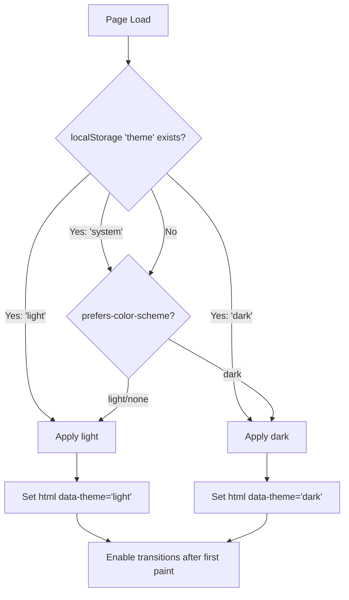

# Design Document: Dark Mode

## Overview

Dark mode adds a second colour scheme to the Garimpo frontend by overriding CSS custom properties via a `data-theme="dark"` attribute on `<html>`. The system automatically detects OS preference, allows manual override with persistence, and prevents FOUC on static pages (Cloudflare Pages, no SSR).

### Key Design Decisions

1. **`:root[data-theme="dark"]` override** — single CSS block overrides only colour tokens; spacing/typography/surfaces unchanged. No separate file, no duplication.
2. **Blocking inline script** — prevents FOUC by resolving theme before first paint (no async, no module, no network).
3. **Svelte store + pure JS** — theme engine is a pure JS module (for the blocking script) exposed as a Svelte store (for reactivity in components).
4. **Warm dark palette** — not inverted. Dark surfaces use warm charcoal (#1a1517), gold/pink accents are lightened for dark backgrounds, maintaining brand identity.
5. **Three-state toggle** — light / dark / system. Placed in header bar. Uses Bits UI-compatible patterns.

## Architecture

### Theme Resolution Flow



### File Structure

```
web/src/
├── app.html                        # Inline blocking script added to <head>
├── lib/
│   ├── theme.js                    # Theme engine (pure JS, no framework deps)
│   └── components/ui/
│       ├── tokens.css              # + :root[data-theme="dark"] block
│       └── ThemeToggle.svelte      # Toggle component (sun/moon/monitor)
└── routes/
    └── +layout.svelte              # ThemeToggle added to header
```

### Module Responsibilities

| Module | Responsibility | Dependencies |
|---|---|---|
| `app.html` inline script | FOUC prevention — resolve + apply before paint | None (pure JS, 10 LOC) |
| `theme.js` | Full theme engine — detect, apply, persist, listen | None (pure JS) |
| `ThemeToggle.svelte` | UI toggle with 3 states | `theme.js`, Svelte 5 runes |
| `tokens.css` | Dark colour definitions | None |

## Components and Interfaces

### Theme Engine (`web/src/lib/theme.js`)

```javascript
/**
 * Theme engine — manages colour scheme detection, persistence, and application.
 * Designed to work both as a blocking script (inline in <head>) and as an
 * importable module (for Svelte components).
 */

/** @typedef {'light' | 'dark' | 'system'} ThemePreference */
/** @typedef {'light' | 'dark'} ResolvedTheme */

const STORAGE_KEY = 'theme';

/** Get stored preference or null */
export function getStoredTheme() { /* localStorage.getItem */ }

/** Resolve the effective theme (stored override or system preference) */
export function resolveTheme() { /* returns 'light' | 'dark' */ }

/** Apply theme to document root */
export function applyTheme(theme) { /* sets data-theme attribute */ }

/** Set user preference and apply */
export function setTheme(preference) { /* persist + apply */ }

/** Subscribe to system preference changes */
export function onSystemChange(callback) { /* matchMedia listener */ }

/** Svelte-compatible reactive store */
export const theme = {
  subscribe, // Svelte store contract
  set: setTheme
};
```

### Blocking Inline Script (`app.html`)

```html
<script>
  // FOUC prevention: resolve theme before any content renders.
  // Must be synchronous, no imports, no async. ~10 LOC.
  (function() {
    try {
      var stored = localStorage.getItem('theme');
      var prefersDark = window.matchMedia('(prefers-color-scheme: dark)').matches;
      var theme = stored === 'dark' ? 'dark'
                : stored === 'light' ? 'light'
                : prefersDark ? 'dark' : 'light';
      document.documentElement.setAttribute('data-theme', theme);
    } catch(e) {
      document.documentElement.setAttribute('data-theme', 'light');
    }
  })();
</script>
```

### ThemeToggle Component

```svelte
<script>
  import { theme } from '$lib/theme.js';
  
  const MODES = ['light', 'dark', 'system'];
  const ICONS = { light: '☀️', dark: '🌙', system: '🖥️' };
  const LABELS = { light: 'Modo claro', dark: 'Modo escuro', system: 'Seguir sistema' };
  
  let current = $state('system');
  
  // Sync from store on mount
  $effect(() => { /* subscribe to theme store */ });
  
  function cycle() {
    const next = MODES[(MODES.indexOf(current) + 1) % MODES.length];
    current = next;
    theme.set(next);
  }
</script>

<button
  class="theme-toggle"
  onclick={cycle}
  aria-label={LABELS[current]}
  title={LABELS[current]}
>
  {ICONS[current]}
</button>
```

## Data Models

### Dark Token Palette

The dark palette follows these principles:
- **Backgrounds**: Warm charcoal/brown tones (not pure black — reduces eye strain)
- **Text**: Warm off-white (not pure white — softer on OLED)
- **Gold accent**: Lightened for dark backgrounds (more saturated, higher luminance)
- **Pink accent**: Lightened and slightly desaturated
- **Feedback**: Darker backgrounds with lighter text (inverted pattern)

```css
:root[data-theme="dark"] {
  /* ── Color: Neutrals ─────────────────────────────── */
  --porcelana: #1a1517;       /* main bg — warm near-black */
  --nevoa: #221e20;           /* card bg — slightly lighter */
  --branco: #2a2527;          /* input bg — elevated surface */
  --linha: #3d3538;           /* borders — subtle warm grey */
  --tinta-suave: #a89a95;    /* secondary text — 4.6:1 on porcelana ✓ */
  --tinta: #f0ebe8;           /* primary text — 13:1 on porcelana ✓ */

  /* ── Color: Ouro Accents ─────────────────────────── */
  --ouro: #d4a845;           /* buttons/accent — 4.8:1 on nevoa ✓ */
  --ouro-hover: #e6be5c;     /* hover — lighter for dark bg */
  --ouro-claro: #8b7230;     /* decorative fills (subdued) */
  --ouro-fundo: #2e2618;     /* badge backgrounds — dark warm */
  --ouro-escuro: #f0d080;    /* text on ouro-fundo — 7.5:1 ✓ */

  /* ── Color: Rosa Accents ─────────────────────────── */
  --rosa: #c47a92;           /* tags — 4.7:1 on nevoa ✓ */
  --rosa-hover: #d4909f;     /* hover — lighter */
  --rosa-fundo: #2d1f24;     /* badge bg — dark warm pink */

  /* ── Color: Feedback — Sucesso ───────────────────── */
  --sucesso-texto: #7ecf95;  /* 5.2:1 on sucesso-fundo ✓ */
  --sucesso-fundo: #1a2e20;
  --sucesso-borda: #345c40;

  /* ── Color: Feedback — Erro ──────────────────────── */
  --erro-texto: #f0887a;     /* 5.0:1 on erro-fundo ✓ */
  --erro-fundo: #2e1a17;
  --erro-borda: #5c3530;

  /* ── Color: Feedback — Aviso ─────────────────────── */
  --aviso-texto: #e0c050;    /* 5.3:1 on aviso-fundo ✓ */
  --aviso-fundo: #2a2415;
  --aviso-borda: #5c4d20;

  /* ── Surfaces (shadow adapts to dark) ────────────── */
  --sombra: 0 1px 3px rgba(0, 0, 0, 0.2),
            0 8px 24px -12px rgba(0, 0, 0, 0.4);
}
```

### Token Mapping Rationale

| Token | Light | Dark | Rationale |
|---|---|---|---|
| `--porcelana` | #f5f0ed (warm white) | #1a1517 (warm black) | Background surfaces — warm tones in both |
| `--tinta` | #2e2226 (dark brown) | #f0ebe8 (warm off-white) | Primary text — high contrast both ways |
| `--ouro` | #9e7422 (deep gold) | #d4a845 (bright gold) | Accent — lightened for dark bg visibility |
| `--rosa` | #944c63 (muted pink) | #c47a92 (light pink) | Accent — lightened for dark bg visibility |
| `--sombra` | subtle (4% opacity) | prominent (20% opacity) | Shadows darker on dark surfaces |

### localStorage Schema

```
key: "theme"
value: "light" | "dark" | "system" | (absent = system)
```

## Correctness Properties

### Property 1: Theme persistence round-trip

*For any* theme preference value (`'light'`, `'dark'`, `'system'`), setting it via `setTheme(value)` and then calling `getStoredTheme()` SHALL return the same value. If `'system'` is set, `getStoredTheme()` SHALL return `'system'` (not the resolved value).

**Validates: Requirements 2.2, 2.3, 2.4**

### Property 2: FOUC-free resolution

*For any* combination of localStorage state and system preference, the blocking inline script SHALL produce the same `data-theme` attribute value as `resolveTheme()` from `theme.js`. The two implementations are equivalent.

**Validates: Requirements 1.1, 1.2, 3.1**

### Property 3: Contrast compliance

*For any* token pair (text token, background token) used together in the design system, the contrast ratio SHALL be ≥ 4.5:1 in both light and dark modes.

**Validates: Requirements 5.1, 5.2, 5.3**

### Property 4: System preference reactivity

*For any* transition of `prefers-color-scheme` from `light` to `dark` or vice versa, when no manual override is stored, the resolved theme SHALL change within one event loop iteration.

**Validates: Requirement 1.3**

## Error Handling

### localStorage unavailable

- **Scenario**: Private browsing, storage quota exceeded, or security restrictions
- **Handling**: `getStoredTheme()` returns `null`, `setTheme()` applies the theme attribute but silently fails to persist. The app remains functional in system-preference mode.

### Invalid stored value

- **Scenario**: User manually edits localStorage to contain garbage
- **Handling**: `resolveTheme()` treats any value other than `'light'` or `'dark'` as `'system'` and falls back to OS preference detection.

### matchMedia unavailable

- **Scenario**: Very old browsers without `prefers-color-scheme` support
- **Handling**: Falls back to `'light'` mode. The toggle still works for manual selection.

### Script execution blocked

- **Scenario**: CSP blocks inline scripts, or JS disabled
- **Handling**: No `data-theme` attribute set → CSS defaults to light mode (`:root` block applies). The page renders correctly in light mode without JS.

## Testing Strategy

### Unit Tests (Vitest)

- `theme.js` — test `resolveTheme()` with mocked localStorage and matchMedia
- Test all combinations: stored light + system dark, stored dark + system light, stored system + system dark, no stored + system light
- Test `setTheme()` persistence and immediate application
- Test invalid localStorage values → fallback to system

### Component Tests (Vitest + @testing-library/svelte)

- `ThemeToggle.svelte` — test cycle through modes on click
- Test aria-label updates per mode
- Test that store is called with correct value

### Contrast Tests (automated)

- For each text/background pair in both modes, compute contrast ratio
- Assert ≥ 4.5:1 for all pairs
- Can be a static test that parses `tokens.css` and computes WCAG ratios

### E2E Tests (Playwright)

- Page loads with system dark → verify `data-theme="dark"` on html
- Toggle click cycles through modes → verify attribute changes
- Reload after setting dark → verify no FOUC (dark on first frame)
- Test localStorage persistence across navigation
