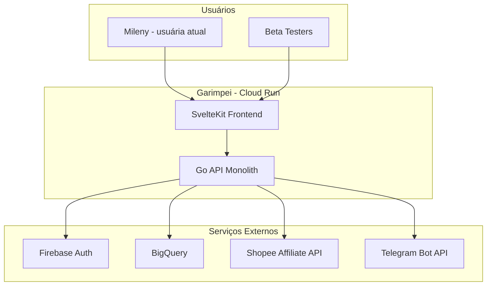
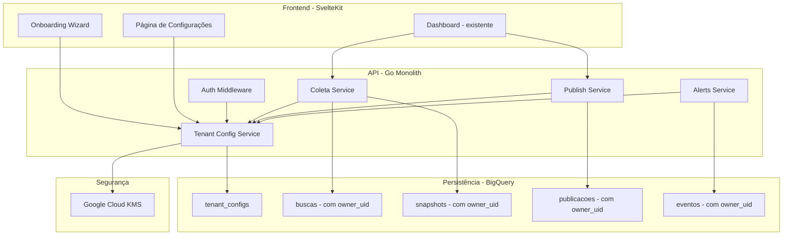
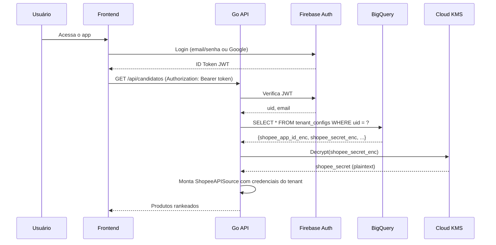
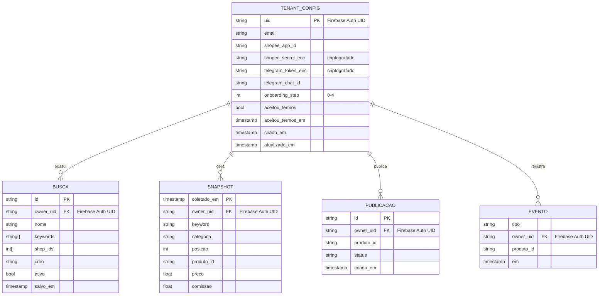

# Documento de Design: Multi-Tenant para Beta Testers

## Overview

O Garimpei atualmente opera em modo single-tenant: as credenciais da API Shopee (AppID + Secret) e a configuração do bot Telegram são variáveis de ambiente globais compartilhadas por todos os usuários. Isso significa que qualquer beta tester que entre no sistema utilizará os tokens da Mileny — o que é inaceitável do ponto de vista de isolamento de dados e segurança.

Esta feature introduz multi-tenancy leve no sistema: cada usuário traz suas próprias credenciais da Shopee Affiliate API, configura opcionalmente seu bot Telegram, e tem seus dados (buscas, snapshots, publicações, eventos) completamente isolados. O sistema atual da Mileny continua funcionando sem interrupções — seus dados e credenciais são migrados para o novo modelo como o primeiro tenant.

A abordagem é incremental: não há billing, não há limites de uso, não há planos. Apenas isolamento de credenciais e dados, com um fluxo de onboarding guiado para que os colegas do Fernando consigam se cadastrar de forma autônoma.

## Architecture

### Diagrama de Contexto (Nível 0)



### Diagrama de Componentes (Nível 2)



### Fluxo de Autenticação e Resolução de Tenant



## Components and Interfaces

### Componente 1: TenantConfigService

**Propósito**: Gerencia as credenciais e configurações por tenant. Responsável por criptografar/descriptografar secrets e validar que as credenciais são funcionais.

**Interface**:
```go
type TenantConfig struct {
    UID             string    `json:"uid"`
    ShopeeAppID     string    `json:"shopee_app_id"`      // plaintext (não é secret)
    ShopeeSecretEnc string    `json:"-"`                  // criptografado (nunca exposto)
    TelegramToken   string    `json:"-"`                  // criptografado
    TelegramChatID  string    `json:"telegram_chat_id"`   // plaintext
    OnboardingStep  int       `json:"onboarding_step"`    // 0-4 (progresso)
    AceitouTermos   bool      `json:"aceitou_termos"`     // LGPD
    AceitouTermosEm time.Time `json:"aceitou_termos_em"`
    CriadoEm        time.Time `json:"criado_em"`
    AtualizadoEm    time.Time `json:"atualizado_em"`
}

type TenantConfigStore interface {
    // Busca config do tenant. Retorna nil se não existe.
    Buscar(ctx context.Context, uid string) (*TenantConfig, error)
    // Salva ou atualiza config do tenant.
    Salvar(ctx context.Context, cfg TenantConfig) error
    // Remove config e dados do tenant (exclusão de conta - LGPD).
    Excluir(ctx context.Context, uid string) error
    // Valida credenciais Shopee fazendo uma chamada de teste à API.
    ValidarCredenciais(ctx context.Context, appID, secret string) error
}
```

**Responsabilidades**:
- Armazenar e recuperar credenciais por UID do Firebase Auth
- Criptografar secrets antes de gravar no BigQuery (via Cloud KMS)
- Descriptografar secrets sob demanda para uso nos services
- Validar que as credenciais Shopee funcionam (chamada de teste à API)
- Rastrear progresso do onboarding

### Componente 2: Auth Middleware (Evolução)

**Propósito**: Evolução do middleware de autenticação para injetar o contexto do tenant em cada request.

**Interface**:
```go
// TenantContext é injetado no context.Context de cada request autenticado.
type TenantContext struct {
    User         *auth.User
    Config       *TenantConfig  // nil se tenant não configurou credenciais
    ShopeeAppID  string         // descriptografado, pronto para uso
    ShopeeSecret string         // descriptografado, pronto para uso
}

// ContextKey para extrair TenantContext do context.
type tenantCtxKey struct{}

// TenantDoContexto extrai o TenantContext do request.
func TenantDoContexto(ctx context.Context) *TenantContext

// RequireConfigured é um middleware que rejeita requests de tenants
// que ainda não completaram o onboarding (credenciais não configuradas).
func RequireConfigured(next http.Handler) http.Handler
```

**Responsabilidades**:
- Extrair UID do JWT (já existe)
- Carregar TenantConfig do BigQuery (cache em memória com TTL curto)
- Descriptografar secrets e injetar no context
- Bloquear acesso a rotas de dados se credenciais não configuradas
- Permitir acesso a rotas de onboarding/settings sem credenciais

### Componente 3: Data Isolation Layer

**Propósito**: Garantir que toda query ao BigQuery filtre por `owner_uid`, exceto para admins.

**Interface**:
```go
// ScopedStore wraps EventoStore adicionando filtro obrigatório por owner_uid.
type ScopedStore struct {
    inner    store.EventoStore
    ownerUID string
    isAdmin  bool
}

// NovoScopedStore cria um store com escopo do tenant.
// Se isAdmin=true, não aplica filtro (visão global).
func NovoScopedStore(inner store.EventoStore, ownerUID string, isAdmin bool) *ScopedStore
```

**Responsabilidades**:
- Interceptar todas as chamadas ao EventoStore
- Adicionar `WHERE owner_uid = ?` em todas as queries de leitura
- Preencher `owner_uid` automaticamente em todas as escritas
- Bypass do filtro para usuários admin (visão global)
- Garantir que snapshots e eventos também tenham `owner_uid`

### Componente 4: Onboarding Wizard (Frontend)

**Propósito**: Guiar o beta tester passo a passo na configuração de suas credenciais.

**Interface**:
```go
// Endpoints do onboarding
// GET  /api/onboarding/status    → progresso atual
// POST /api/onboarding/termos    → aceitar termos LGPD
// POST /api/onboarding/shopee    → salvar credenciais Shopee
// POST /api/onboarding/telegram  → salvar config Telegram (opcional)
// POST /api/onboarding/validar   → testar credenciais e finalizar
```

**Responsabilidades**:
- Apresentar guia passo-a-passo com screenshots
- Step 1: Aceitar Termos de Uso e Política de Privacidade (LGPD)
- Step 2: Instruções para criar conta Shopee Affiliate + inserir AppID/Secret
- Step 3: Instruções para criar bot Telegram (opcional, pode pular)
- Step 4: Validação das credenciais com chamada de teste à API Shopee
- Salvar progresso do onboarding para permitir retomar depois

## Data Models

### Tabela: `tenant_configs` (Nova)

```sql
CREATE TABLE IF NOT EXISTS `PROJECT.garimpo.tenant_configs` (
  uid               STRING NOT NULL,    -- Firebase Auth UID (PK lógica)
  email             STRING,             -- email do usuário (para referência)
  shopee_app_id     STRING,             -- AppID da Shopee (plaintext)
  shopee_secret_enc STRING,             -- Secret criptografado (Cloud KMS)
  telegram_token_enc STRING,            -- Token do bot criptografado
  telegram_chat_id  STRING,             -- Chat ID (plaintext)
  onboarding_step   INT64 DEFAULT 0,    -- progresso (0=início, 4=completo)
  aceitou_termos    BOOL DEFAULT FALSE, -- LGPD
  aceitou_termos_em TIMESTAMP,
  criado_em         TIMESTAMP,
  atualizado_em     TIMESTAMP
)
PARTITION BY DATE(atualizado_em);
```

**Regras de validação**:
- `uid` é obrigatório e único (última linha por uid é o estado atual — append-only)
- `shopee_app_id` e `shopee_secret_enc` são obrigatórios para `onboarding_step >= 2`
- `telegram_token_enc` e `telegram_chat_id` são opcionais (step 3 pode ser pulado)
- `aceitou_termos` deve ser `TRUE` antes de salvar credenciais

### Evolução das Tabelas Existentes

As tabelas `snapshots` e `eventos` precisam ganhar a coluna `owner_uid`:

```sql
-- Migração: adicionar owner_uid às tabelas que não têm
ALTER TABLE `PROJECT.garimpo.snapshots` ADD COLUMN owner_uid STRING;
ALTER TABLE `PROJECT.garimpo.eventos` ADD COLUMN owner_uid STRING;

-- Backfill: dados existentes pertencem à Mileny
UPDATE `PROJECT.garimpo.snapshots` SET owner_uid = 'MILENY_UID' WHERE owner_uid IS NULL;
UPDATE `PROJECT.garimpo.eventos` SET owner_uid = 'MILENY_UID' WHERE owner_uid IS NULL;
```

### Diagrama ER Atualizado (Foco Multi-Tenant)



## Correctness Properties

### Property 1: Isolamento de dados entre tenants
Para todo par de tenants (A, B) onde A ≠ B e nenhum é admin, as queries de A nunca retornam dados com `owner_uid = B`.

### Property 2: Visibilidade total para admin
Para todo admin, queries retornam dados de todos os tenants (sem filtro por `owner_uid`).

### Property 3: Integridade de criptografia
Para toda string S, `Decrypt(Encrypt(S, key), key) == S`.

### Property 4: Onboarding monotônico
O `onboarding_step` de um tenant nunca decresce — só avança ou permanece constante.

### Property 5: Credenciais obrigatórias para rotas de dados
Para todo request a rotas de dados (exceto onboarding/settings), o tenant deve ter `onboarding_step >= 4` (credenciais validadas).

### Property 6: Secrets nunca expostos em responses
Nenhum endpoint HTTP retorna `shopee_secret` ou `telegram_token` em plaintext no corpo da resposta.

### Property 7: Owner UID sempre preenchido nas escritas
Para toda escrita em qualquer tabela (buscas, snapshots, publicações, eventos), o campo `owner_uid` é preenchido com o UID do tenant autenticado.

### Property 8: Compatibilidade reversa com dados existentes
Após migração, todas as queries da Mileny retornam exatamente os mesmos dados que retornavam antes da feature.

## Error Handling

### Cenário 1: Credenciais Shopee Inválidas

**Condição**: Usuário insere AppID/Secret incorretos ou revogados
**Resposta**: A validação no Step 4 do onboarding faz chamada de teste à API. Se retornar erro 10020 (assinatura inválida) ou 403, mostra mensagem clara: "Credenciais inválidas. Verifique se copiou o AppID e Secret corretos do painel de afiliados."
**Recuperação**: Usuário corrige e tenta novamente. Não salva credenciais inválidas.

### Cenário 2: Credenciais Expiram Após Onboarding

**Condição**: Shopee revoga ou expira as credenciais depois de configuradas
**Resposta**: Coletas do tenant falham com erro 403/10020. Sistema marca tenant como "credenciais_invalidas" e notifica (se Telegram configurado).
**Recuperação**: Usuário acessa Settings e reconfigura credenciais. Fluxo de validação é o mesmo do onboarding.

### Cenário 3: Tenant Sem Configuração Acessa Rotas de Dados

**Condição**: Usuário logado mas sem onboarding completo tenta acessar /api/candidatos
**Resposta**: Middleware `RequireConfigured` retorna 403 com corpo `{"erro": "onboarding_incompleto", "step": N}`.
**Recuperação**: Frontend redireciona para o onboarding wizard no step correto.

### Cenário 4: Falha na Descriptografia (KMS)

**Condição**: Cloud KMS indisponível ou chave deletada
**Resposta**: Erro 503 — "Serviço temporariamente indisponível". Log de erro com detalhes.
**Recuperação**: Retry automático com backoff. Se persistir, alertar admin.

### Cenário 5: Exclusão de Conta (LGPD)

**Condição**: Usuário solicita exclusão de todos os seus dados
**Resposta**: Deleta `tenant_configs` + todas as linhas com `owner_uid` do usuário em todas as tabelas.
**Recuperação**: Irreversível. Confirmação dupla no frontend antes de executar.

## Testing Strategy

### Testes Unitários

- `TenantConfigStore`: CRUD de configs, criptografia/descriptografia mock
- `ScopedStore`: verifica que queries incluem `WHERE owner_uid = ?`
- `ScopedStore` com admin: verifica que filtro é bypassado
- Auth middleware: injeção correta de `TenantContext` no context
- Validação de credenciais: mock da API Shopee com respostas de sucesso/erro

### Testes de Propriedade (Property-Based)

**Biblioteca**: `testing/quick` (stdlib Go)

- Para qualquer `owner_uid` não-admin, dados de outro tenant nunca aparecem no resultado
- Para qualquer admin, todos os dados aparecem sem filtro
- Criptografar → descriptografar retorna o valor original para qualquer string
- Onboarding step nunca decresce (só avança)

### Testes de Integração

- Fluxo completo de onboarding: criar conta → aceitar termos → inserir credenciais → validar
- Coleta com credenciais de tenant isolado (mock da API Shopee)
- Migração de dados: dados da Mileny continuam acessíveis após migração
- Exclusão de conta: confirmar que todos os dados são removidos

## Performance Considerations

- **Cache de TenantConfig**: cache em memória com TTL de 5 minutos para evitar query ao BigQuery em cada request. Invalidação no write.
- **Descriptografia**: Cloud KMS tem latência de ~50ms. Secrets descriptografados são cacheados no contexto do request (não persiste entre requests).
- **BigQuery com owner_uid**: a coluna `owner_uid` deve ser adicionada ao clustering das tabelas particionadas para queries eficientes.
- **Compatibilidade reversa**: se `owner_uid` é NULL em dados legados, tratamos como dados da Mileny (fallback para o UID dela).

## Security Considerations

- **Secrets nunca em plaintext no BigQuery**: AppID fica em plaintext (não é secret confidencial), mas Secret e Telegram Token são criptografados com Cloud KMS.
- **Princípio do menor privilégio**: service account do Cloud Run tem permissão apenas para criptografar/descriptografar com a chave específica do Garimpei.
- **Secrets nunca no response**: endpoints de config retornam `shopee_secret: "***"` (mascarado). Apenas o status (configurado/não configurado) é exposto.
- **Audit trail**: toda alteração de credenciais é logada (Cloud Logging).
- **Rate limiting no onboarding**: máximo 10 tentativas de validação por hora por UID para evitar brute-force.
- **LGPD**: termos aceitos com timestamp, direito de exclusão implementado, dados isolados por tenant.

## Dependencies

| Dependência | Motivo | Status |
|-------------|--------|--------|
| Google Cloud KMS | Criptografia de secrets at rest | Novo — precisa habilitar API |
| Firebase Auth | Autenticação (JWT) | Já em uso |
| BigQuery | Persistência de tenant_configs + dados isolados | Já em uso (nova tabela) |
| SvelteKit | Frontend do onboarding wizard | Já em uso (novas páginas) |

## Compatibilidade Reversa

A migração deve ser transparente para a Mileny (usuária atual):

1. **Criar `tenant_configs`** com os dados atuais das env vars (AppID, Secret, Telegram) para o UID da Mileny
2. **Backfill `owner_uid`** nos dados existentes (snapshots, eventos) com o UID da Mileny
3. **Manter env vars como fallback**: se `TenantConfig` não existe para um UID, o sistema usa as env vars globais (apenas durante transição)
4. **Remover fallback** quando todos os beta testers estiverem onboarded

## Fases de Implementação

1. **Fase 1**: Tabela `tenant_configs` + endpoints de onboarding + criptografia KMS
2. **Fase 2**: `ScopedStore` + migração `owner_uid` em snapshots/eventos + backfill Mileny
3. **Fase 3**: Frontend do onboarding wizard (SvelteKit)
4. **Fase 4**: Páginas de Settings (alterar credenciais) + exclusão de conta (LGPD)
5. **Fase 5**: Remover fallback de env vars globais
