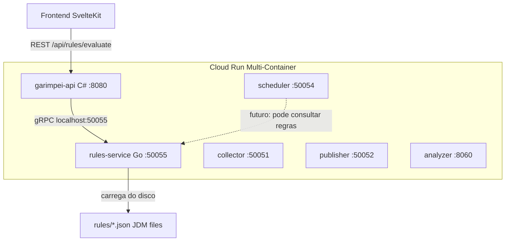
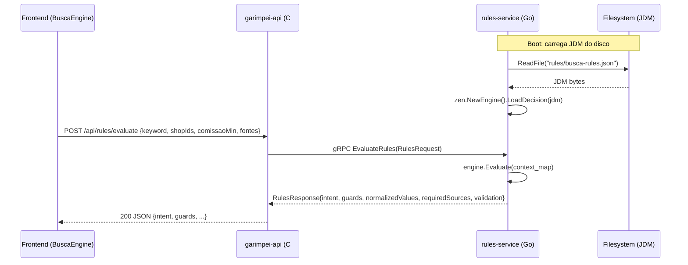
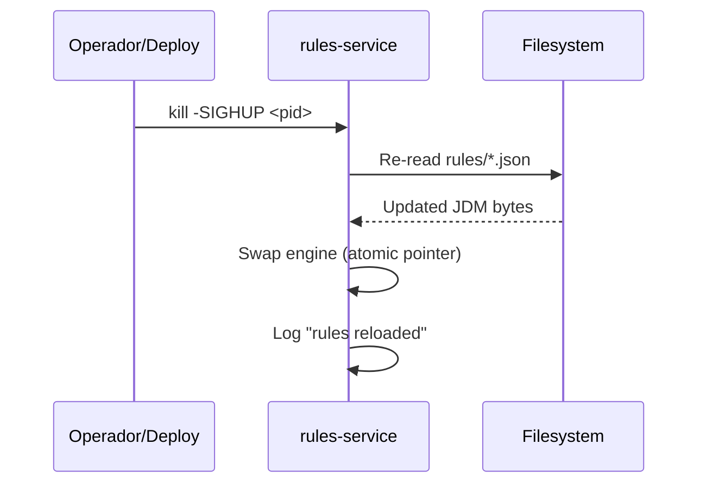

# Design Document: Rules Service (GoRules zen-go)

## Overview

Serviço de regras como sidecar Go na porta 50055 do Cloud Run multi-container, usando gorules/zen-go para avaliar Decision Models JSON (JDM) versionados no git. O sidecar recebe contexto de busca via gRPC, avalia decision tables, expression nodes e switch nodes, e retorna decisões estruturadas (intent, guards, normalização, fontes, validação).

A separação do scheduler é intencional: o scheduler orquestra QUANDO (cron), o rules service decide O QUÊ (avaliação de regras puras, sem I/O). A API C# expõe um endpoint REST `/api/rules/evaluate` que faz proxy gRPC para o sidecar, e o frontend consome esse endpoint para decisões complexas.

## Architecture




## Sequence Diagrams

### Fluxo principal: Frontend → API → Rules Service



### Hot-reload via SIGHUP




## Components and Interfaces

### Component 1: rules-service (Go gRPC server)

**Purpose**: Avaliar JDM decision models contra contexto de busca recebido via gRPC.

**Interface (Proto)**:
```protobuf
service RulesService {
  rpc EvaluateRules(EvaluateRulesRequest) returns (EvaluateRulesResponse);
  rpc ReloadRules(ReloadRulesRequest) returns (ReloadRulesResponse);
}
```

**Responsibilities**:
- Carregar JDM do disco no boot
- Avaliar regras contra contexto arbitrário (map string→value)
- Hot-reload via SIGHUP sem downtime
- Health check para Cloud Run startup probe

### Component 2: garimpei-api proxy endpoint (C#)

**Purpose**: Expor regras via REST para o frontend, fazendo proxy gRPC para o sidecar.

**Interface**:
```csharp
[HttpPost("/api/rules/evaluate")]
public async Task<IActionResult> EvaluateRules([FromBody] RulesEvaluateRequest request)
```

**Responsibilities**:
- Validar input do frontend
- Converter JSON → gRPC request
- Converter gRPC response → JSON
- Autenticação via middleware existente (Firebase JWT)

### Component 3: JDM Decision Files

**Purpose**: Decision models versionados no git, editáveis via GoRules Editor ou manualmente.

**Localização**: `rules/busca-rules.json` (no repo, deployado no container)

**Responsibilities**:
- Definir decision tables para intent, guards, normalização, fontes, validação
- Ser versionável e revisável via PR


## Data Models

### Proto: rules/v1/rules.proto

```protobuf
syntax = "proto3";

package rules.v1;

option go_package = "github.com/fmarquesfilho/garimpo/gen/go/rules/v1;rulesv1";
option csharp_namespace = "Garimpei.Protos.Rules.V1";

service RulesService {
  // Avalia regras JDM contra o contexto fornecido
  rpc EvaluateRules(EvaluateRulesRequest) returns (EvaluateRulesResponse);
  // Recarrega JDM do disco (alternativa programática ao SIGHUP)
  rpc ReloadRules(ReloadRulesRequest) returns (ReloadRulesResponse);
}

message EvaluateRulesRequest {
  // Contexto de busca como map flexível (keyword, shopIds, comissaoMin, etc.)
  map<string, string> context = 1;
  // Opcional: nome do decision model a avaliar (default: "busca-rules")
  string decision_id = 2;
}

message EvaluateRulesResponse {
  // Intent de busca resolvido
  string intent = 1;
  // Guards avaliados
  GuardsResult guards = 2;
  // Valores normalizados
  NormalizedValues normalized = 3;
  // Fontes de dados necessárias
  repeated string required_sources = 4;
  // Validação (para saves)
  ValidationResult validation = 5;
  // Performance
  int64 evaluation_time_us = 6;
}

message GuardsResult {
  bool tem_contexto_busca = 1;
  bool pode_salvar = 2;
  bool loja_input_valida = 3;
}

message NormalizedValues {
  double comissao_min = 1;
  int32 vendas_min = 2;
}

message ValidationResult {
  bool valid = 1;
  repeated string errors = 2;
}

message ReloadRulesRequest {}

message ReloadRulesResponse {
  bool success = 1;
  string message = 2;
  int32 rules_loaded = 3;
}
```


### Go Structs: RulesServer

```go
package main

import (
    "sync/atomic"
    "log/slog"

    zen "github.com/gorules/zen-go"
    rulesv1 "github.com/fmarquesfilho/garimpo/gen/go/rules/v1"
)

// RulesServer implementa rules.v1.RulesService.
type RulesServer struct {
    rulesv1.UnimplementedRulesServiceServer

    logger   *slog.Logger
    rulesDir string

    // Atomic pointer para hot-reload sem lock no path quente
    engine atomic.Pointer[zen.Engine]

    // Map de decision_id → decision bytes (para múltiplos JDMs no futuro)
    decisions atomic.Pointer[map[string][]byte]
}

// Config para inicialização do server.
type Config struct {
    RulesDir string // default: "rules/"
    Port     string // default: "50055"
}
```

### JDM Example: busca-rules.json (simplificado)

```json
{
  "nodes": [
    {
      "id": "input-1",
      "type": "inputNode",
      "name": "Request"
    },
    {
      "id": "dt-intent",
      "type": "decisionTableNode",
      "name": "Intent de Busca",
      "content": {
        "hitPolicy": "first",
        "inputs": [
          {"field": "hasKeyword", "name": "Tem Keyword"},
          {"field": "hasShop", "name": "Tem Loja"}
        ],
        "outputs": [
          {"field": "intent", "name": "Intent"}
        ],
        "rules": [
          {"_id": "r1", "hasKeyword": "true", "hasShop": "true", "intent": "keyword_na_loja"},
          {"_id": "r2", "hasKeyword": "true", "hasShop": "false", "intent": "keyword_global"},
          {"_id": "r3", "hasKeyword": "false", "hasShop": "true", "intent": "loja_completa"},
          {"_id": "r4", "hasKeyword": "false", "hasShop": "false", "intent": "nenhum"}
        ]
      }
    },
    {
      "id": "dt-guards",
      "type": "decisionTableNode",
      "name": "Guards",
      "content": {
        "hitPolicy": "first",
        "inputs": [
          {"field": "hasKeyword", "name": "Tem Keyword"},
          {"field": "hasShop", "name": "Tem Loja"}
        ],
        "outputs": [
          {"field": "temContextoBusca", "name": "Tem Contexto"},
          {"field": "podeSalvar", "name": "Pode Salvar"}
        ],
        "rules": [
          {"_id": "g1", "hasKeyword": "true", "hasShop": "",     "temContextoBusca": "true", "podeSalvar": "true"},
          {"_id": "g2", "hasKeyword": "",     "hasShop": "true", "temContextoBusca": "true", "podeSalvar": "true"},
          {"_id": "g3", "hasKeyword": "false","hasShop": "false","temContextoBusca": "false","podeSalvar": "false"}
        ]
      }
    },
    {
      "id": "expr-normalize",
      "type": "expressionNode",
      "name": "Normalização",
      "content": {
        "expressions": [
          {
            "key": "comissaoMin",
            "value": "if context.comissaoMin > 1 then context.comissaoMin / 100 else context.comissaoMin"
          },
          {
            "key": "vendasMin",
            "value": "math.max(0, math.floor(context.vendasMin))"
          }
        ]
      }
    },
    {
      "id": "output-1",
      "type": "outputNode",
      "name": "Response"
    }
  ],
  "edges": [
    {"sourceId": "input-1", "targetId": "dt-intent"},
    {"sourceId": "input-1", "targetId": "dt-guards"},
    {"sourceId": "input-1", "targetId": "expr-normalize"},
    {"sourceId": "dt-intent", "targetId": "output-1"},
    {"sourceId": "dt-guards", "targetId": "output-1"},
    {"sourceId": "expr-normalize", "targetId": "output-1"}
  ]
}
```


## Key Functions with Formal Specifications

### Function 1: NewRulesServer()

```go
func NewRulesServer(cfg Config, logger *slog.Logger) (*RulesServer, error)
```

**Preconditions:**
- `cfg.RulesDir` aponta para diretório existente com ao menos 1 arquivo `.json`
- `logger` não é nil

**Postconditions:**
- Retorna `*RulesServer` com engine carregado e pronto para avaliar
- Se diretório não existe ou JDM inválido: retorna error
- Engine é thread-safe para avaliação concorrente

### Function 2: EvaluateRules()

```go
func (s *RulesServer) EvaluateRules(
    ctx context.Context,
    req *rulesv1.EvaluateRulesRequest,
) (*rulesv1.EvaluateRulesResponse, error)
```

**Preconditions:**
- `req.Context` contém ao menos 1 key-value
- Engine está carregado (atomic pointer != nil)

**Postconditions:**
- Retorna `EvaluateRulesResponse` com todos os campos preenchidos
- `evaluation_time_us` contém tempo real de avaliação em microsegundos
- Se `decision_id` vazio, usa "busca-rules" como default
- Se `decision_id` não existe: retorna gRPC NotFound
- Nenhum I/O externo é feito (avaliação pura em memória)
- Thread-safe: múltiplas goroutines podem avaliar simultaneamente

**Loop Invariants:** N/A (avaliação é single-pass pelo grafo JDM)

### Function 3: reloadRules()

```go
func (s *RulesServer) reloadRules() error
```

**Preconditions:**
- `s.rulesDir` é diretório acessível
- Ao menos 1 arquivo `.json` válido existe no diretório

**Postconditions:**
- Atomic swap do engine pointer (zero downtime)
- Requests em voo continuam usando o engine antigo até completar
- Se reload falha: engine antigo permanece ativo, retorna error
- Log de sucesso/falha é emitido

### Function 4: setupSignalHandler()

```go
func (s *RulesServer) setupSignalHandler()
```

**Preconditions:**
- Server está inicializado

**Postconditions:**
- SIGHUP dispara `reloadRules()`
- SIGINT/SIGTERM disparam graceful shutdown
- Signal handler roda em goroutine separada


## Algorithmic Pseudocode

### Main Processing: EvaluateRules

```go
func (s *RulesServer) EvaluateRules(ctx context.Context, req *rulesv1.EvaluateRulesRequest) (*rulesv1.EvaluateRulesResponse, error) {
    start := time.Now()

    // 1. Resolve decision ID
    decisionID := req.GetDecisionId()
    if decisionID == "" {
        decisionID = "busca-rules"
    }

    // 2. Load current engine (atomic read, no lock)
    engine := s.engine.Load()
    if engine == nil {
        return nil, status.Error(codes.Unavailable, "engine not loaded")
    }

    // 3. Build evaluation context from request map
    evalCtx := buildEvalContext(req.GetContext())

    // 4. Evaluate decision (pure, no I/O)
    result, err := engine.Evaluate(decisionID, evalCtx)
    if err != nil {
        return nil, status.Errorf(codes.Internal, "evaluation failed: %v", err)
    }

    // 5. Map result to response proto
    resp := mapResultToResponse(result)
    resp.EvaluationTimeUs = time.Since(start).Microseconds()

    return resp, nil
}
```

### Boot: Load JDM from disk

```go
func (s *RulesServer) loadRules() error {
    entries, err := os.ReadDir(s.rulesDir)
    if err != nil {
        return fmt.Errorf("read rules dir %s: %w", s.rulesDir, err)
    }

    decisions := make(map[string][]byte)
    for _, entry := range entries {
        if entry.IsDir() || !strings.HasSuffix(entry.Name(), ".json") {
            continue
        }
        path := filepath.Join(s.rulesDir, entry.Name())
        data, err := os.ReadFile(path)
        if err != nil {
            return fmt.Errorf("read rule %s: %w", path, err)
        }
        id := strings.TrimSuffix(entry.Name(), ".json")
        decisions[id] = data
    }

    if len(decisions) == 0 {
        return fmt.Errorf("no JDM files found in %s", s.rulesDir)
    }

    // Create new engine with loaded decisions
    engine, err := zen.NewEngine(zen.EngineConfig{
        Loader: &fileLoader{decisions: decisions},
    })
    if err != nil {
        return fmt.Errorf("create zen engine: %w", err)
    }

    // Atomic swap
    s.engine.Store(engine)
    s.decisions.Store(&decisions)
    s.logger.Info("rules loaded", slog.Int("count", len(decisions)))

    return nil
}
```

### Context Builder

```go
func buildEvalContext(raw map[string]string) map[string]interface{} {
    ctx := make(map[string]interface{}, len(raw))
    for k, v := range raw {
        // Tenta parsear como número para expressions
        if f, err := strconv.ParseFloat(v, 64); err == nil {
            ctx[k] = f
        } else if b, err := strconv.ParseBool(v); err == nil {
            ctx[k] = b
        } else {
            ctx[k] = v
        }
    }
    // Derive booleans para decision tables
    ctx["hasKeyword"] = raw["keyword"] != ""
    ctx["hasShop"] = raw["shopIds"] != ""
    return ctx
}
```


## Example Usage

### Go: Server bootstrap (main.go)

```go
func main() {
    logger := slog.New(slog.NewJSONHandler(os.Stdout, &slog.HandlerOptions{Level: slog.LevelInfo}))

    cfg := Config{
        RulesDir: envOrDefault("RULES_DIR", "rules/"),
        Port:     envOrDefault("PORT", "50055"),
    }

    server, err := NewRulesServer(cfg, logger)
    if err != nil {
        logger.Error("failed to create rules server", slog.String("error", err.Error()))
        os.Exit(1)
    }

    lis, _ := net.Listen("tcp", ":"+cfg.Port)
    srv := grpc.NewServer()
    rulesv1.RegisterRulesServiceServer(srv, server)

    healthSrv := health.NewServer()
    healthpb.RegisterHealthServer(srv, healthSrv)
    healthSrv.SetServingStatus("rules.v1.RulesService", healthpb.HealthCheckResponse_SERVING)

    server.setupSignalHandler() // SIGHUP → reload, SIGINT → shutdown
    srv.Serve(lis)
}
```

### C#: Proxy endpoint

```csharp
[ApiController]
[Route("api/rules")]
public class RulesController : ControllerBase
{
    private readonly RulesService.RulesServiceClient _rulesClient;

    public RulesController(RulesService.RulesServiceClient rulesClient)
        => _rulesClient = rulesClient;

    [HttpPost("evaluate")]
    public async Task<IActionResult> Evaluate([FromBody] RulesEvaluateDto dto)
    {
        var request = new EvaluateRulesRequest { DecisionId = dto.DecisionId ?? "" };
        foreach (var (key, value) in dto.Context)
            request.Context.Add(key, value);

        var response = await _rulesClient.EvaluateRulesAsync(request);

        return Ok(new {
            intent = response.Intent,
            guards = new {
                temContextoBusca = response.Guards.TemContextoBusca,
                podeSalvar = response.Guards.PodeSalvar,
                lojaInputValida = response.Guards.LojaInputValida
            },
            normalized = new {
                comissaoMin = response.Normalized.ComissaoMin,
                vendasMin = response.Normalized.VendasMin
            },
            requiredSources = response.RequiredSources.ToList(),
            validation = new {
                valid = response.Validation.Valid,
                errors = response.Validation.Errors.ToList()
            },
            evaluationTimeUs = response.EvaluationTimeUs
        });
    }
}

public record RulesEvaluateDto(
    Dictionary<string, string> Context,
    string? DecisionId = null
);
```

### Frontend: BuscaEngine integration

```javascript
// Em busca-engine-effects.js (novo method)
async evaluateRules(ctx) {
    const context = {
        keyword: ctx.keyword,
        shopIds: ctx.shopIds.join(','),
        comissaoMin: String(ctx.comissaoMin),
        vendasMin: String(ctx.vendasMin),
        fontes: Object.entries(ctx.fontes).filter(([,v]) => v).map(([k]) => k).join(',')
    };
    const resp = await this.api.post('/api/rules/evaluate', { context });
    return resp.data;
}
```


## Correctness Properties

### Property 1: Determinismo

Para o mesmo contexto de entrada e o mesmo JDM, `EvaluateRules` sempre retorna o mesmo resultado.

```go
// ∀ ctx, decision: Evaluate(ctx, decision) == Evaluate(ctx, decision)
assert.Equal(t, eval1, eval2)
```

### Property 2: Completude do Intent

Todo contexto válido produz exatamente um dos 4 intents: `keyword_na_loja`, `keyword_global`, `loja_completa`, `nenhum`.

```go
validIntents := []string{"keyword_na_loja", "keyword_global", "loja_completa", "nenhum"}
assert.Contains(t, validIntents, resp.Intent)
```

### Property 3: Normalização idempotente

Normalizar um valor já normalizado não o altera.

```go
// normalize(normalize(x)) == normalize(x)
assert.Equal(t, normalize(0.07), normalize(normalize(0.07)))
```

### Property 4: Reload atômico

Durante reload, nenhuma avaliação retorna erro ou resultado parcial.

```go
// Concurrent: reload em goroutine + evaluate em N goroutines → zero errors
```

### Property 5: Guards consistentes

`podeSalvar` só é true quando `temContextoBusca` também é true.

```go
if resp.Guards.PodeSalvar {
    assert.True(t, resp.Guards.TemContextoBusca)
}
```

### Property 6: Fontes coerentes com intent

Se intent é `nenhum`, `required_sources` deve ser vazio.

```go
if resp.Intent == "nenhum" {
    assert.Empty(t, resp.RequiredSources)
}
```

## Error Handling

### Erro 1: Engine não carregado

**Condition**: Server inicia mas falha ao ler JDM do disco (arquivo corrompido, permissão)
**Response**: gRPC `UNAVAILABLE` — health check falha, Cloud Run não roteia tráfego
**Recovery**: Corrigir JDM e restart ou SIGHUP

### Erro 2: Decision ID não encontrado

**Condition**: Cliente pede `decision_id` que não existe no map de decisions carregadas
**Response**: gRPC `NOT_FOUND` com mensagem indicando IDs disponíveis
**Recovery**: Cliente usar ID correto ou omitir para usar default

### Erro 3: JDM inválido durante reload

**Condition**: SIGHUP disparado mas novo JDM tem erro de parse
**Response**: Reload falha, engine antigo permanece ativo, log de erro emitido
**Recovery**: Corrigir JDM e enviar novo SIGHUP — zero downtime

### Erro 4: Context map vazio

**Condition**: Cliente envia request sem context
**Response**: gRPC `INVALID_ARGUMENT` — "context must have at least 1 key"
**Recovery**: Cliente enviar contexto adequado


## Testing Strategy

### Unit Testing Approach

```go
func TestEvaluateRules_Intent(t *testing.T) {
    srv := setupTestServer(t, "testdata/busca-rules.json")

    tests := []struct{
        name    string
        ctx     map[string]string
        intent  string
    }{
        {"keyword+shop", map[string]string{"keyword": "serum", "shopIds": "123"}, "keyword_na_loja"},
        {"keyword only", map[string]string{"keyword": "serum", "shopIds": ""},    "keyword_global"},
        {"shop only",    map[string]string{"keyword": "", "shopIds": "123"},       "loja_completa"},
        {"empty",        map[string]string{"keyword": "", "shopIds": ""},          "nenhum"},
    }
    for _, tt := range tests {
        t.Run(tt.name, func(t *testing.T) {
            resp, err := srv.EvaluateRules(context.Background(), &rulesv1.EvaluateRulesRequest{Context: tt.ctx})
            require.NoError(t, err)
            assert.Equal(t, tt.intent, resp.Intent)
        })
    }
}
```

### Property-Based Testing

**Library**: `pgregory.net/rapid`

```go
func TestEvaluateRules_Deterministic(t *testing.T) {
    srv := setupTestServer(t, "testdata/busca-rules.json")

    rapid.Check(t, func(t *rapid.T) {
        ctx := map[string]string{
            "keyword":     rapid.StringMatching(`[a-z]{0,20}`).Draw(t, "keyword"),
            "shopIds":     rapid.StringMatching(`[0-9]{0,10}`).Draw(t, "shopIds"),
            "comissaoMin": fmt.Sprintf("%f", rapid.Float64Range(0, 100).Draw(t, "comissao")),
        }
        req := &rulesv1.EvaluateRulesRequest{Context: ctx}

        r1, err1 := srv.EvaluateRules(context.Background(), req)
        r2, err2 := srv.EvaluateRules(context.Background(), req)

        require.NoError(t, err1)
        require.NoError(t, err2)
        assert.Equal(t, r1.Intent, r2.Intent)
        assert.Equal(t, r1.Guards, r2.Guards)
        assert.Equal(t, r1.Normalized, r2.Normalized)
    })
}
```

### Integration Testing

- gRPC client → server real com JDM de teste
- Testar reload: modify file, send SIGHUP, assert new rules aplicadas
- Testar concorrência: N goroutines avaliando + 1 goroutine reloading

## Performance Considerations

- **Avaliação**: ~50-200μs por request (zen-engine é Rust via CGO, otimizado para avaliação rápida)
- **Memória**: JDM típico < 50KB em memória, engine overhead ~2MB
- **Concorrência**: Atomic pointer permite reads sem lock; avaliação é thread-safe
- **Cold start**: < 100ms (load JDM + init engine)
- **Cloud Run resources**: CPU 0.25, RAM 128Mi (suficiente para avaliação pura)
- **Cache no frontend**: Decisões podem ser cacheadas por 30s (regras mudam raramente)

## Security Considerations

- Endpoint protegido por autenticação Firebase JWT (middleware existente na API C#)
- Context map é string→string: sem risco de injection no engine (JDM é read-only)
- JDM carregado do filesystem local (não de URL externa)
- SIGHUP aceito apenas pelo processo owner (OS-level security)
- gRPC interno via localhost (sem TLS necessário, isolamento do pod Cloud Run)

## Dependencies

| Dependência | Versão | Propósito |
|-------------|--------|-----------|
| gorules/zen-go | latest | Avaliação JDM (binding Go do zen-engine Rust) |
| google.golang.org/grpc | v1.68+ | Server gRPC |
| google.golang.org/grpc/health | v1.68+ | Health check |
| pgregory.net/rapid | v1.1+ | Property-based testing |
| github.com/stretchr/testify | v1.9+ | Test assertions |

## Deployment

### Dockerfile

```dockerfile
FROM golang:1.22-alpine AS builder
WORKDIR /app
COPY go.mod go.sum ./
RUN go mod download
COPY . .
RUN CGO_ENABLED=1 go build -o /rules-service ./services/rules

FROM alpine:3.20
RUN apk add --no-cache ca-certificates
COPY --from=builder /rules-service /rules-service
COPY rules/ /rules/
EXPOSE 50055
ENTRYPOINT ["/rules-service"]
```

### Cloud Run service.yaml (snippet adicional)

```yaml
- container:
    image: gcr.io/garimpo-500114/rules-service:latest
    ports:
      - containerPort: 50055
    resources:
      limits:
        cpu: "0.25"
        memory: 128Mi
    startupProbe:
      grpc:
        service: rules.v1.RulesService
      initialDelaySeconds: 1
      periodSeconds: 2
      failureThreshold: 5
    env:
      - name: RULES_DIR
        value: /rules/
      - name: PORT
        value: "50055"
```

### C# DI Registration

```csharp
// Program.cs
builder.Services.AddGrpcClient<RulesService.RulesServiceClient>(o =>
{
    o.Address = new Uri("http://localhost:50055");
});
```
