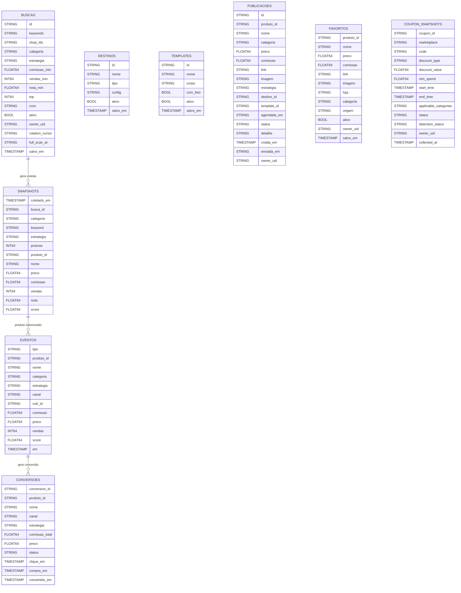

:::caution[Arquivo gerado]
Não edite manualmente. Rode `mise run docs:er` para regenerar.
:::

## Particionamento

| Tabela | Partição |
|---|---|
| `eventos` | `DATE(em)` |
| `snapshots` | `DATE(coletado_em)` |
| `buscas` | `DATE(salvo_em)` |
| `conversoes` | `DATE(compra_em)` |
