# Fluxos de Requisição — Diagramas de Sequência

Documentação detalhada de como cada caso de uso se traduz em chamadas entre
componentes, quais dados são armazenados onde, e como o data ownership é respeitado.

**Convenções:**
- 🟢 PostgreSQL (C# API é o dono exclusivo)
- 🔵 BigQuery (Go escreve, Python lê)
- ☁️ APIs externas (Shopee, Amazon, Telegram, WhatsApp)
- 📦 Cloud Tasks (barramento durável entre serviços)

---

## 1. Descobrir Produtos (Curadoria)

O usuário busca por palavras-chave. O sistema consulta a API de afiliados em tempo real,
aplica scoring e retorna candidatos rankeados.

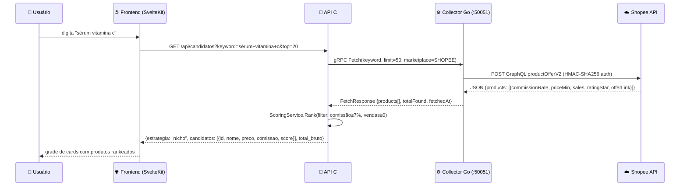

<details>
<summary>📋 Detalhes técnicos</summary>

**Data ownership:** Nenhum dado é armazenado neste fluxo. É uma consulta real-time
pura (stateless). O C# API não grava no PostgreSQL nem no BigQuery.

**Scoring:** `Score = 0.45×norm(comissão) + 0.35×norm(EV) + 0.20×norm(rating)`
onde EV = preço × comissão × vendas.

**Autenticação Shopee:** `Signature = SHA256(AppId + timestamp + jsonBody + Secret)`.
Header: `Authorization: SHA256 Credential={AppId}, Timestamp={ts}, Signature={sig}`

**Rate limit:** 200ms throttle entre páginas, 60s entre lojas diferentes.

**Escalabilidade:** O Collector é stateless — pode escalar horizontalmente. Cada
request é independente. Não há cache (dados sempre frescos da API).

</details>

---

## 2. Publicar Oferta (Manual)

O usuário seleciona um produto, escolhe destino e template, e publica para Telegram/WhatsApp.
O link enviado é um link curto de afiliada gerado via Collector (com sub_ids para rastreamento).

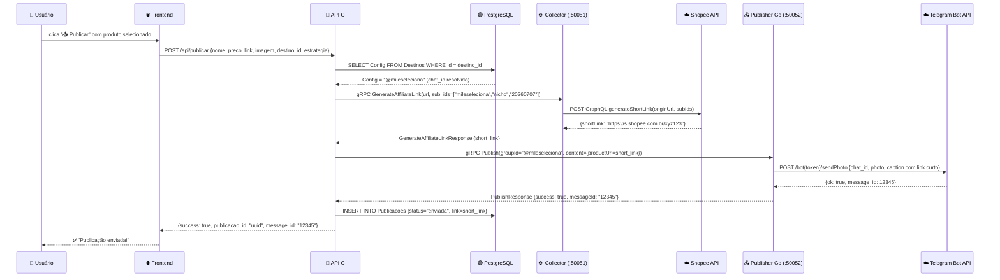

<details>
<summary>📋 Detalhes técnicos</summary>

**Data ownership:**
- 🟢 PostgreSQL: `Destinos` (leitura do chat_id), `Publicacoes` (escrita do registro)
- O Publisher Go **nunca** acessa o PostgreSQL — recebe o chat_id já resolvido via gRPC
- O Collector Go gera o link de afiliada via Shopee GraphQL (I/O externo)

**Link de afiliada (GenerateAffiliateLink):**
- Recebe a URL original do produto + sub_ids para rastreamento
- Sub IDs: `[canal, estrategia, data]` → voltam no `conversionReport.utmContent`
- Se falhar (Collector indisponível), usa o link original como fallback

**Resolução de destino:** O `destino_id` do frontend é um UUID do PostgreSQL. O C#
resolve para o `Config` real (chat_id ou telefone) antes de chamar o Publisher.

**Fallback:** Se `sendPhoto` falha (CDN Shopee bloqueada), o Publisher tenta
`sendMessage` com texto puro (graceful degradation).

**Escalabilidade:** Publisher é stateless. Telegram limita 30 msg/s global e
1 msg/s por chat. O Cloud Tasks cuida do throttle em cenários automáticos.

</details>

---

## 2.1. Publicar Oferta Agendada

O usuário agenda uma publicação para o futuro. O Scheduler dispara no horário correto.

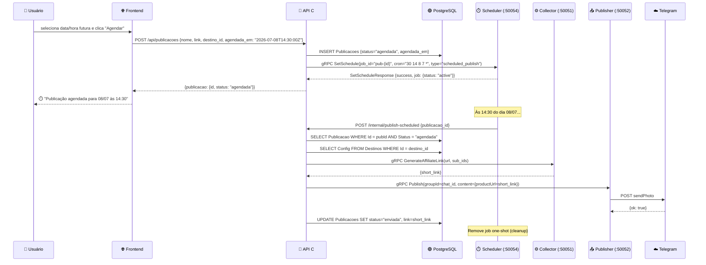

<details>
<summary>📋 Detalhes técnicos</summary>

**Separação de responsabilidades:**
- C# API: CRUD + resolve dados + gera link + chama Publisher (O QUÊ)
- Scheduler Go: cron one-shot + disparo no horário correto (QUANDO)
- Collector Go: GenerateAffiliateLink (I/O externo com Shopee)
- Publisher Go: envio Telegram/WhatsApp (COMO entregar)

**Cron one-shot:** O SetSchedule recebe `cron="30 14 8 7 *"` (minuto 30, hora 14,
dia 8, mês 7, qualquer dia da semana). O Scheduler executa uma vez e remove o job.

**Eventual consistency:** Se o Scheduler estiver indisponível ao criar, a Publicacao
persiste no PG com status "agendada" — pode ser reconciliada depois.

**Endpoint interno:** `/internal/publish-scheduled` não requer auth (rede interna
Cloud Run). O Scheduler faz HTTP POST com `{publicacao_id}`.

</details>

---

## 3. Coleta Agendada + Alerta de Preço (Automático)

O scheduler dispara coletas periódicas. Após cada coleta, verifica se houve quedas
significativas e notifica o usuário via Telegram.

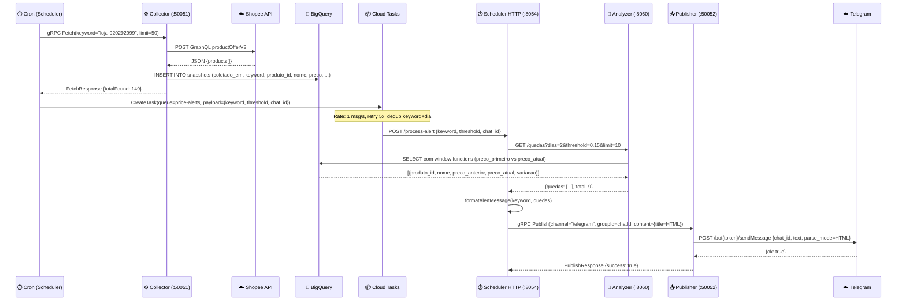

<details>
<summary>📋 Detalhes técnicos</summary>

**Data ownership:**
- 🔵 BigQuery: Collector **escreve** snapshots (append-only, particionado por dia)
- 🔵 BigQuery: Analyzer **lê** snapshots (queries analíticas com window functions)
- 🟢 PostgreSQL: **não envolvido** neste fluxo automático
- O Scheduler **orquestra** mas não toca dados diretamente

**Cloud Tasks (barramento durável):**
- Queue: `price-alerts` em `southamerica-east1`
- Rate limit: 1 dispatch/s (Telegram safe)
- Retry: 5 tentativas, backoff 10s→300s
- Deduplicação: task name = `alert-{keyword}-{YYYY-MM-DD}` (1 alerta por keyword por dia)

**Detecção de variações (query BigQuery):**
```sql
FIRST_VALUE(preco) OVER (PARTITION BY produto_id ORDER BY coletado_em ASC) AS preco_primeiro
LAST_VALUE(preco) OVER (PARTITION BY produto_id ORDER BY coletado_em ASC ...) AS preco_atual
SAFE_DIVIDE(preco_atual - preco_primeiro, preco_primeiro) AS variacao
WHERE variacao <= -threshold
```

**Escalabilidade:**
- Collector escala horizontalmente (Cloud Run auto-scale)
- BigQuery escala infinitamente para leitura
- Cloud Tasks controla o rate entre serviços
- Múltiplos tenants = múltiplas tasks na queue, processadas 1/s

</details>

---

## 4. Monitorar Lojas — Novidades e Variações

O usuário navega para `/lojas`, seleciona uma loja monitorada, e vê produtos novos
e variações de preço dos últimos dias.

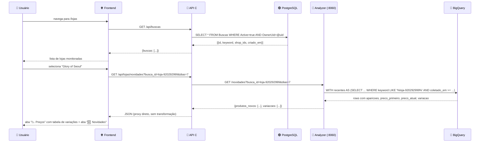

<details>
<summary>📋 Detalhes técnicos</summary>

**Data ownership:**
- 🟢 PostgreSQL: `Buscas` — lista de lojas monitoradas (CRUD do C#)
- 🔵 BigQuery: `snapshots` — dados históricos (escrito pelo Collector, lido pelo Analyzer)
- O C# API faz **proxy transparente** para o Analyzer (não transforma dados)

**Classificação de produtos:**
- **Produto novo**: aparece apenas 1× na janela (nunca coletado antes)
- **Variação**: `|preco_atual - preco_primeiro| / preco_primeiro > 1%`

**Não armazena detecções:** As variações são calculadas em runtime via query BQ.
Não há tabela de "detecções" — é sempre recalculado. Isso garante zero dados obsoletos.

**Escalabilidade:** BigQuery aceita centenas de queries concorrentes. 1000 tenants
consultando novidades = 1000 queries BQ paralelas (cada uma ~200ms).

</details>

---

## 5. Adicionar Loja (Resolver Shop ID)

O usuário adiciona uma loja informando URL ou username. O sistema resolve o shop_id
real via Collector gRPC, persiste a busca, e registra um job no Scheduler para coleta periódica.

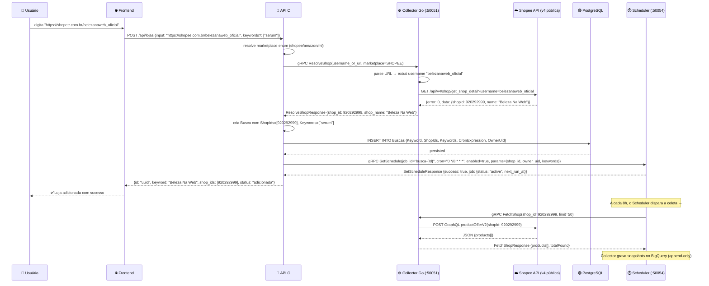

<details>
<summary>📋 Detalhes técnicos</summary>

**Data ownership:**
- 🟢 PostgreSQL: `Buscas` — C# API é o dono exclusivo, grava o perfil de monitoramento
- ⏱️ Scheduler: dono dos jobs periódicos — registra/pausa jobs via SetSchedule
- O Collector Go **não acessa o PostgreSQL** — faz apenas I/O externo (Shopee API v4)
- O C# API **não faz scraping direto** — delega ao Collector via gRPC (bounded context)

**Integração com Scheduler:**
- O C# API chama `SetSchedule(enabled=true)` ao criar a busca
- O C# API chama `SetSchedule(enabled=false)` ao deletar a busca
- Se o Scheduler estiver indisponível, a Busca persiste no PG (eventual consistency)
- O Scheduler armazena os params do job (shop_id, owner_uid, keywords) em memória

**Fluxo de coleta periódica (disparado pelo cron do Scheduler):**
1. Cron trigger → `dispatchJob()` → `executeJob()`
2. Se `params["type"] == "shop_collection"` → usa FetchShop(shop_id)
3. Se keywords estão presentes → passa como filtro para Fetch(keyword, shop_id)
4. Collector consulta Shopee → grava snapshots no BigQuery
5. Scheduler enfileira alerta via Cloud Tasks (se configurado)

**Pipeline de detecção (pós-coleta):**
```
Scheduler coleta → BigQuery (snapshots)
                        ↓
Frontend GET /api/lojas/novidades → C# proxy → Analyzer /novidades
                                                    ↓
                                            BigQuery query (window functions)
                                                    ↓
                                            {produtos_novos[], variacoes[]}
```

**Modos de monitoramento:**
- Sem keywords: `FetchShop(shop_id)` — coleta TODOS os produtos da loja
- Com keywords: `Fetch(keyword)` para cada keyword — coleta apenas produtos que matcham

</details>

---

## 6. Coleta de Cupons + Detecção

O scheduler coleta cupons de múltiplos marketplaces e o analyzer detecta novos/modificados/expirados.

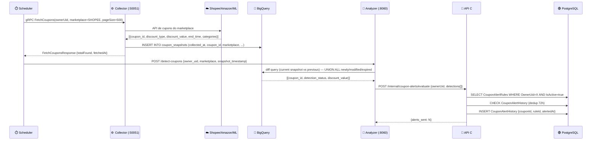

<details>
<summary>📋 Detalhes técnicos</summary>

**Data ownership:**
- 🔵 BigQuery: `coupon_snapshots` — append-only, TTL 90 dias (Collector escreve)
- 🔵 BigQuery: Analyzer **lê** para fazer o diff entre snapshots
- 🟢 PostgreSQL: `CouponAlertRules` + `CouponAlertHistory` — regras e dedup (C# API gerencia)

**Cross-boundary communication:**
O Analyzer detecta cupons no BigQuery e **não acessa o PostgreSQL**. Ele faz HTTP POST
para o C# API que é o dono do PG. O dado nunca pula a fronteira.

**Deduplicação:** Um mesmo cupom+regra só gera alerta 1× a cada 72h (CouponAlertHistory).
Se o desconto muda (detection_status="modified"), um novo alerta é permitido.

**Sequencial por marketplace:** Shopee → Amazon → Mercado Livre (3 chamadas sequenciais).
Se um falha, os outros continuam (graceful degradation).

</details>

---

## 7. Publicar a Partir de Variação de Preço

O usuário vê uma queda na aba Preços e clica "📤" para publicar aquela oferta.

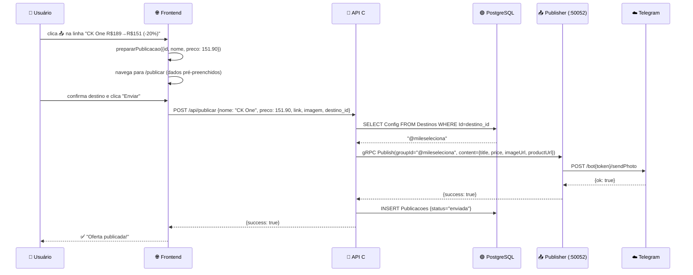

<details>
<summary>📋 Detalhes técnicos</summary>

**Data ownership:**
- 🟢 PostgreSQL: `Destinos` (lê chat_id), `Publicacoes` (grava registro)
- Nenhum dado do BigQuery é acessado neste fluxo

**Dados pré-preenchidos:** O frontend usa `prepararPublicacao()` que serializa
o produto no URL params para a página /publicar. O preço atual (pós-queda) é
o que vai na publicação.

**Sem duplicação de dados:** A variação de preço não é "salva" em nenhum lugar.
O produto vai direto para publicação com o preço atual da Shopee.

</details>

---

## 8. Onboarding (Configuração Multi-Tenant)

Fluxo multi-step de cadastro do tenant. Puramente CRUD no PostgreSQL.

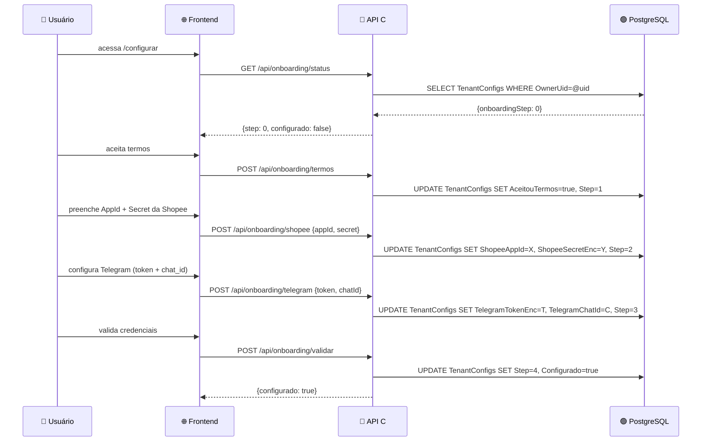

<details>
<summary>📋 Detalhes técnicos</summary>

**Data ownership:** 100% PostgreSQL via C# API. Nenhum sidecar envolvido.

**Multi-tenancy:** Todos os dados são filtrados por `owner_uid` via EF Core
global query filters. Tenant A nunca vê dados de Tenant B.

**Segurança:** Credenciais (secret, tokens) são armazenadas com sufixo `Enc`
indicando que deverão ser encriptadas (T-0045 pendente).

**Escalabilidade:** CRUD simples com PostgreSQL. Escala naturalmente com o banco.

</details>

---

## 9. Dashboard (Estatísticas e Evolução)

A página de estatísticas mostra métricas agregadas, evolução de preço, e contagem de quedas/altas.

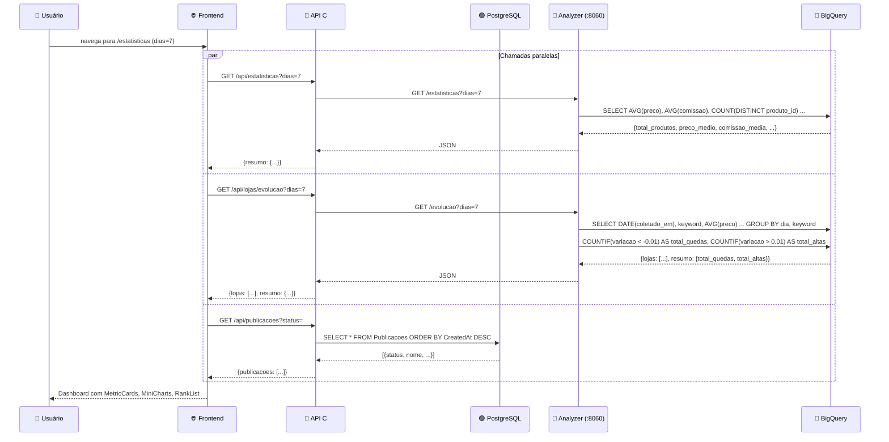

<details>
<summary>📋 Detalhes técnicos</summary>

**Data ownership:**
- 🔵 BigQuery: Analyzer lê snapshots para estatísticas e evolução
- 🟢 PostgreSQL: publicações (C# API lê para contagem e ranking)

**Proxy transparente:** O C# API faz proxy para o Analyzer sem transformar dados.
Se o Analyzer estiver offline, retorna fallback vazio (graceful degradation).

**3 chamadas paralelas:** O frontend dispara as 3 requisições simultaneamente
(`Promise.all`). O dashboard carrega assim que todas respondem.

**Escalabilidade:** Queries BQ são independentes e podem rodar em paralelo.
O C# API é stateless (proxying only). Suporta N tenants simultâneos.

</details>

---

## 10. Resolver Link Shopee

Utilitário para extrair dados de um link curto da Shopee (s.shopee.com.br/xxx).

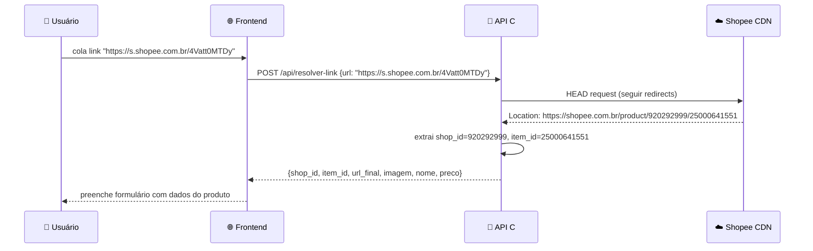

<details>
<summary>📋 Detalhes técnicos</summary>

**Data ownership:** Nenhum dado armazenado. Operação stateless.

**Uso:** Na página /publicar, quando o usuário cola um link em vez de selecionar
um produto da curadoria. Resolve o link para obter imagem, nome e preço.

</details>

---

## 11. CRUD de Canais e Templates

Gerenciamento de destinos de publicação e templates de mensagem. Puramente PostgreSQL.

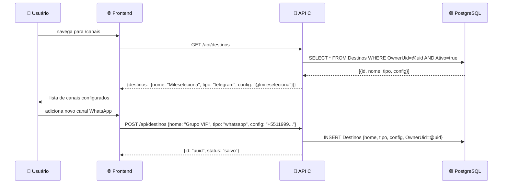

<details>
<summary>📋 Detalhes técnicos</summary>

**Data ownership:** 100% PostgreSQL. Nenhum sidecar envolvido.

**Multi-tenancy:** `Destinos`, `Templates` têm `OwnerUid` com global query filter.
Cada tenant vê apenas seus próprios canais.

**O Publisher não conhece Destinos:** O Publisher recebe `groupId` (chat_id/telefone)
já resolvido. Ele não sabe que existem "destinos" no PostgreSQL.

</details>

---

## Resumo: Data Ownership por Caso de Uso

| Caso de Uso | PostgreSQL (C#) | BigQuery (Go→Python) | APIs Externas |
|---|---|---|---|
| 1. Descobrir | — | — | Shopee/Amazon (real-time) |
| 2. Publicar | ✍ Destinos, Publicacoes | — | Telegram/WhatsApp + Shopee (GenerateAffiliateLink) |
| 2.1. Publicar Agendada | ✍ Publicacoes | — | Scheduler (timer) + Telegram/WhatsApp + Shopee |
| 3. Coleta+Alerta | — | ✍ snapshots | Shopee → BQ → Telegram |
| 4. Monitorar Lojas | 📖 Buscas | 📖 snapshots (via Analyzer) | — |
| 5. Adicionar Loja | ✍ Buscas | — | Shopee v4 (via Collector gRPC) + Scheduler SetSchedule |
| 6. Cupons | ✍ AlertRules, AlertHistory | ✍ coupon_snapshots, 📖 diff | Shopee/Amazon/ML |
| 7. Publicar Variação | ✍ Destinos, Publicacoes | — | Telegram |
| 8. Onboarding | ✍ TenantConfigs | — | — |
| 9. Dashboard | 📖 Publicacoes | 📖 snapshots (via Analyzer) | — |
| 10. Resolver Link | — | — | Shopee CDN (redirect) |
| 11. Canais/Templates | ✍ Destinos, Templates | — | — |

**Legenda:** ✍ = escreve, 📖 = lê, — = não envolvido

---

## Fluxos Pendentes de Implementação

| Fluxo | Status | Descrição |
|---|---|---|
| Publicações agendadas | ✅ Implementado | Usuário agenda para data futura → C# persiste + Scheduler.SetSchedule(one-shot cron) → Scheduler dispara POST /internal/publish-scheduled → C# gera link de afiliada + envia via Publisher. |
| Coleta por shop_id no Scheduler | ✅ Implementado | O Scheduler executa `Collector.FetchShop(shop_id)` para jobs do tipo `shop_collection`. Jobs com keywords fazem `Fetch(keyword)` para cada keyword individualmente. |
| Alertas de cupons → Telegram | ⬜ Parcial (T-0045) | Detecção funciona mas envio para Telegram do tenant ainda não wired. |

---

## Princípios de Escalabilidade

| Princípio | Como está implementado |
|---|---|
| **Stateless services** | Todos os serviços são stateless — estado fica no PG/BQ |
| **Horizontal scaling** | Cloud Run auto-scale 0→N para cada container |
| **Rate limiting externo** | Cloud Tasks controla throughput entre serviços |
| **Event-driven alerts** | Coleta → task → processamento assíncrono |
| **Query isolation** | Cada query BQ é independente (sem locks, sem transações) |
| **Graceful degradation** | Analyzer offline → fallback vazio; Publisher fail → retry |
| **Deduplication** | Cloud Tasks (keyword+dia), CouponAlertHistory (72h window) |
| **Data locality** | PostgreSQL para CRUD, BigQuery para analytics (each at what it does best) |
