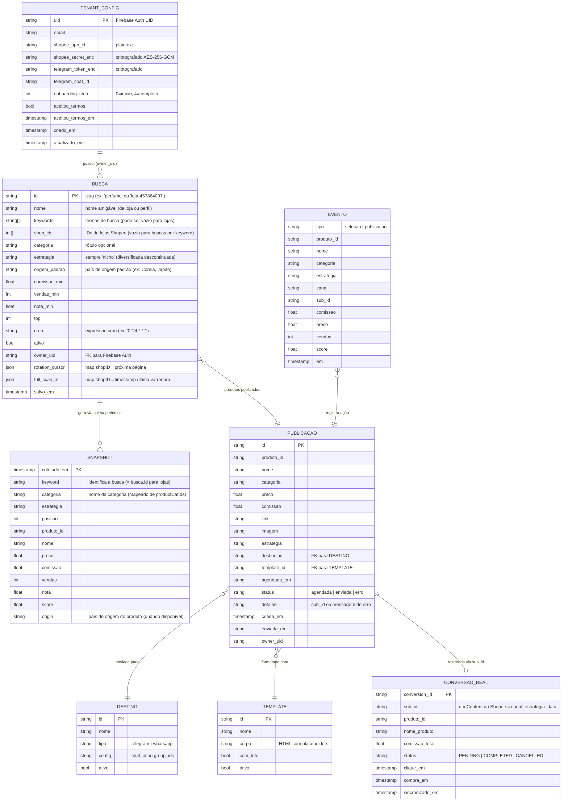

# Diagrama de Entidades — Garimpei

Atualizado em: 2026-06-27

## Diagrama ER (Mermaid)

## Regras de negócio

| Entidade | Regra |
|----------|-------|
| BUSCA com `shop_ids` | É monitoramento de loja. Gera coleta com `productOfferV2(shopId)`. |
| BUSCA com `keywords` | É busca por palavra-chave. Gera coleta com `productOfferV2(keyword)`. |
| BUSCA sem `keywords` nem `shop_ids` | Inválida (rejeitada pela API). |
| SNAPSHOT.keyword | Para lojas = `busca.id` (ex: "loja-457864097"). Para keywords = o termo buscado. |
| PUBLICACAO.detalhe | Quando status=enviada, contém o `sub_id`. Quando status=erro, contém a mensagem. |
| CONVERSAO_REAL.sub_id | Cruza com `PUBLICACAO.detalhe` para fechar o ciclo. |

## Decisões tomadas

- **1:1 entre Busca e Loja** — cada loja monitorada é uma Busca separada.
- **Estratégia sempre "nicho"** — diversificada foi descontinuada da UI e do service.
- **Categorias vêm da API Shopee** — `productCatIds` mapeados para nomes via `categories.go`.
- **CONVERSAO_REAL** — tabela futura, endpoint `/api/conversoes/sync` já implementado.
- **Origem do produto** — campo `Origin` no Product e ItemSnapshot. API pede `shopType` e `sellerLocation`; fallback: `origem_padrao` na Busca.
- **Multi-tenant** — cada usuário configura suas credenciais Shopee + Telegram via onboarding. Secrets criptografados com AES-256-GCM.
- **Schema evolution automática** — `EnsureSchema` no startup adiciona colunas novas a tabelas existentes (sem migração manual).
